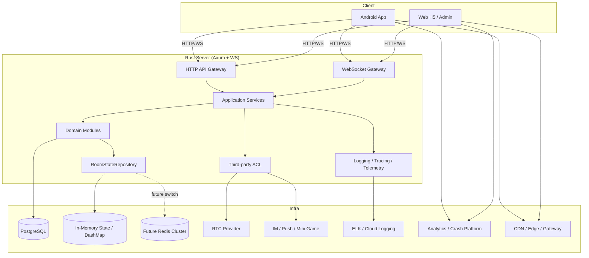

# 1. 文档目标

本文档定义实时语聊房项目的目标生产级架构，用于统一指导以下三端后续代码生成与业务开发：

- **Server**：Rust + Axum + SQLx + PostgreSQL + Tungstenite
- **Android**：Kotlin + Gradle 8.7 + XML UI + OkHttp
- **Web 管理/H5**：Vite + React + Tailwind + shadcn/ui

本架构以以下原则为准：
1. **服务端权威**：房间、麦位、礼物、钱包等核心状态以 Server 为唯一事实源。
2. **DDD + 模块化**：按业务域拆分 bounded context，采用 Package by Feature，确保高内聚、低耦合。
3. **可替换外部依赖**：RTC、IM、小游戏、风控、支付、埋点、崩溃上报等第三方设施必须通过防腐层接入。
4. **商业化强一致性**：金币、收益、账单流水必须通过数据库事务保证一致。
5. **弱网可恢复**：核心链路必须具备心跳、重连、幂等、防重和状态回补能力，严格处理消息乱序。
6. **中东本土化优先**：架构初期即支持多语言、阿拉伯语 RTL、时区与本地化文案。
7. **多环境可切换**：本地开发、测试环境、生产环境必须通过统一配置体系管理，禁止硬编码环境变量。
8. **可观测与可排障**：关键链路必须具备结构化日志、链路追踪、客户端埋点、崩溃上报与在线检索能力。

---

# 2. 总体架构概览



## 2.1 分层原则

| 层级 | 职责 | 禁止事项 |
| --- | --- | --- |
| **Interface / Controller** | HTTP/WS 协议适配、参数校验、鉴权上下文提取 | 写业务规则、直接拼 SQL |
| **Application / Service** | 编排用例、事务边界、跨模块协作 | 持有 UI/SDK 细节 |
| **Domain** | 实体、值对象、领域规则、领域事件 | 依赖第三方 SDK |
| **Repository** | 数据访问抽象 | 承载复杂业务决策 |
| **Infrastructure** | DB、缓存、第三方 SDK 封装、日志、配置、埋点上报 | 泄露实现细节给上层 |

---

# 3. Monorepo 目录结构与 DDD 设计

下述为目标目录结构，即使当前仓库尚未完全创建，也必须按该结构落地。  
**Server 端严格采用 Package by Feature 的模块化设计，避免全局服务和领域层混乱；三端都必须为基建目录预留明确位置。**

```text
/
├── doc/                                  # 架构、协议、排障、接口与运维文档
│   ├── ARCHITECTURE.md                   # 本文档：系统总架构与开发约束
│   ├── API.md                            # HTTP API 契约文档
│   ├── WS_PROTOCOL.md                    # WebSocket 信令协议文档
│   ├── ERROR_CODE.md                     # 全局错误码定义
│   ├── DB_SCHEMA.md                      # 数据库表结构与索引设计
│   ├── RUNBOOK.md                        # 联调、编译、排障、发布 SOP
│   └── DEBUG_SOP.md                      # AI/开发者通用调试与故障定位方法论
│
├── shared/                               # 跨端共享定义；只放“稳定契约”，不放端内实现
│   ├── contracts/                        # 三端共享协议定义
│   │   ├── http/                         # HTTP 请求/响应契约示例
│   │   ├── ws/                           # WebSocket 事件与载荷契约
│   │   ├── enums/                        # 通用枚举定义（状态、角色、错误类型）
│   │   └── examples/                     # 示例报文，供 AI 与人工联调参考
│   ├── localization/                     # 多语言 key 与文案规范
│   │   ├── ar/                           # 阿拉伯语文案
│   │   ├── en/                           # 英语文案
│   │   └── key-conventions.md            # i18n key 命名约定
│   └── assets/                           # 跨端可复用静态资源说明或规范
│
├── app/
│   ├── server/
│   │   ├── .env.example                  # 服务端环境变量模板，禁止提交真实密钥
│   │   ├── .env                          # 本地开发环境变量，仅本地存在
│   │   ├── Cargo.toml                    # Rust 依赖声明
│   │   ├── rustfmt.toml                  # Rust 格式化规则
│   │   ├── .sqlx/                        # SQLx 离线编译缓存目录，供 CI 使用
│   │   ├── migrations/                   # 数据库迁移脚本
│   │   ├── config/                       # 分环境配置文件目录
│   │   │   ├── default.toml              # 默认配置
│   │   │   ├── local.toml                # 本地开发配置
│   │   │   ├── test.toml                 # 测试环境配置
│   │   │   └── prod.toml                 # 生产环境配置
│   │   └── src/
│   │       ├── main.rs                   # 应用入口
│   │       ├── bootstrap/                # 启动装配、依赖注入、路由注册
│   │       ├── config/                   # 配置读取、环境识别、密钥装载
│   │       ├── common/                   # 全局通用代码
│   │       │   ├── error/                # 全局错误定义与错误码映射
│   │       │   ├── result/               # 统一返回体封装
│   │       │   ├── auth/                 # AuthContext、Claims、鉴权基础类型
│   │       │   ├── middleware/           # HTTP/WS 中间件
│   │       │   ├── tracing/              # tracing 初始化与字段注入
│   │       │   ├── telemetry/            # 日志字段、trace_id、request_id 基础工具
│   │       │   ├── types/                # 跨模块基础类型
│   │       │   └── utils/                # 通用工具函数
│   │       ├── infrastructure/           # 全局基建与防腐层落地目录
│   │       │   ├── db/                   # PostgreSQL 连接池、事务工厂、仓储基础设施
│   │       │   ├── cache/                # DashMap / Redis 客户端与状态缓存封装
│   │       │   ├── logging/              # 日志落地、输出格式、采样策略
│   │       │   ├── telemetry/            # 观测基建、链路追踪、指标打点
│   │       │   ├── messaging/            # 站内消息、推送、广播总线抽象
│   │       │   ├── gateway/              # 对外网关或内部服务网关适配
│   │       │   ├── storage/              # 对象存储、文件上传、媒体资源元数据
│   │       │   ├── security/             # 签名、加密、限流、风控基础组件
│   │       │   ├── config_provider/      # 远程配置/配置中心适配层（预留）
│   │       │   └── third_party/          # 第三方服务适配层
│   │       │       ├── rtc/              # Agora 等 RTC Provider 适配
│   │       │       ├── im/               # IM / 消息服务适配
│   │       │       ├── analytics/        # 埋点/日志上报服务端转发或聚合适配
│   │       │       ├── crash/            # 崩溃/告警平台服务端适配（预留）
│   │       │       ├── moderation/       # 审核/风控/内容安全适配
│   │       │       ├── sms/              # 短信服务适配
│   │       │       ├── payment/          # 支付服务适配
│   │       │       └── cdn/              # CDN / 边缘加速配置适配
│   │       └── modules/                  # 业务模块目录，严格 Package by Feature
│   │           ├── auth/                 # 登录、刷新、会话、设备绑定
│   │           ├── user/                 # 用户资料、等级、在线状态
│   │           ├── room/                 # 房间生命周期与成员管理
│   │           ├── seat/                 # 麦位状态与上/下麦逻辑
│   │           ├── wallet/               # 钱包、余额、冻结、流水
│   │           ├── gift/                 # 礼物定义、送礼、广播
│   │           ├── billing/              # 收益、分成、结算、账单
│   │           ├── rtc/                  # RTC Token、频道映射、媒体会话
│   │           ├── moderation/           # 风控、封禁、踢人、敏感词
│   │           ├── notification/         # 站内通知与系统消息
│   │           ├── family/               # 家族系统（未来扩展）
│   │           ├── cp/                   # CP 关系（未来扩展）
│   │           ├── vip/                  # 贵族/VIP 特权（未来扩展）
│   │           ├── backpack/             # 背包、道具、资产（未来扩展）
│   │           ├── game/                 # 小游戏接入（未来扩展）
│   │           └── admin/                # 后台运营与管理端
│   │
│   ├── android/
│   │   ├── build.gradle.kts              # Android 顶层构建配置
│   │   ├── gradle.properties             # Gradle 构建参数
│   │   ├── local.properties              # 本地私密配置，不可提交
│   │   ├── .editorconfig                 # Kotlin/XML 风格规范
│   │   └── app/
│   │       ├── build.gradle.kts          # App 模块构建；定义 productFlavors
│   │       └── src/main/
│   │           ├── java/com/example/.../
│   │           │   ├── core/             # 全局基建与平台能力
│   │           │   │   ├── network/      # OkHttp、拦截器、Token 刷新、环境切换
│   │           │   │   ├── ws/           # WS 客户端、心跳、重连、消息分发
│   │           │   │   ├── telemetry/    # 埋点、日志缓冲、崩溃上报、防腐层
│   │           │   │   ├── media/        # RTC 防腐层（IMediaService）
│   │           │   │   ├── im/           # IM 防腐层（IIMService）
│   │           │   │   ├── config/       # BuildConfig、环境识别、远程配置
│   │           │   │   ├── i18n/         # 多语言与 RTL 支持
│   │           │   │   ├── storage/      # 本地缓存、SQLite/Room、文件存储
│   │           │   │   ├── security/     # 签名、加密、设备标识、安全存储
│   │           │   │   └── logging/      # 本地日志、采样、调试辅助
│   │           │   ├── common/           # 公共 UI、Result、State、Base 类
│   │           │   ├── data/             # DTO、RemoteDataSource、LocalDataSource、RepositoryImpl
│   │           │   ├── domain/           # 领域模型、仓储接口、UseCase
│   │           │   ├── presentation/     # BaseActivity/BaseFragment、导航、通用状态管理
│   │           │   └── feature/          # 业务模块页面
│   │           │       ├── auth/         # 登录注册
│   │           │       ├── room/         # 房间页
│   │           │       ├── seat/         # 麦位与申请上麦
│   │           │       ├── gift/         # 礼物与送礼
│   │           │       ├── wallet/       # 钱包
│   │           │       ├── profile/      # 用户资料
│   │           │       ├── family/       # 家族（预留）
│   │           │       ├── cp/           # CP（预留）
│   │           │       ├── vip/          # 贵族（预留）
│   │           │       ├── backpack/     # 背包（预留）
│   │           │       └── game/         # 小游戏（预留）
│   │           └── res/
│   │               ├── layout/           # XML 布局
│   │               ├── values/           # 默认文案、主题、尺寸
│   │               ├── values-ar/        # 阿拉伯语文案
│   │               ├── drawable/         # 图片与形状资源
│   │               └── xml/              # networkSecurityConfig 等 XML 配置
│   │
│   └── web/
│       ├── package.json                  # 前端依赖与脚本
│       ├── vite.config.ts                # Vite 配置与本地代理
│       ├── tsconfig.json                 # TypeScript 配置
│       ├── .env.example                  # 前端环境变量模板
│       ├── .env.development              # 开发环境变量
│       ├── .env.production               # 生产环境变量
│       ├── .eslintrc.cjs                 # ESLint 规则
│       ├── .prettierrc                   # Prettier 规则
│       └── src/
│           ├── app/                      # App 根组件、Provider、Router、Store
│           ├── core/                     # 全局基建层
│           │   ├── network/              # Axios/fetch 封装、拦截器、环境切换
│           │   ├── ws/                   # WS 客户端、重连、心跳、事件总线
│           │   ├── telemetry/            # 埋点、错误上报、日志缓冲、ErrorBoundary
│           │   ├── i18n/                 # 多语言与 RTL 引擎
│           │   ├── config/               # 环境变量读取、远程配置
│           │   ├── security/             # Token、设备信息、安全工具
│           │   └── constants/            # 常量定义
│           ├── api/                      # HTTP API 定义层
│           ├── hooks/                    # 复用 Hook
│           ├── services/                 # 第三方服务适配层
│           │   ├── media/                # RTC Provider 适配
│           │   ├── im/                   # IM Provider 适配
│           │   ├── analytics/            # 埋点 Provider 适配
│           │   └── crash/                # 前端错误上报 Provider 适配
│           ├── components/               # 通用 UI 组件
│           ├── features/                 # 业务功能组件
│           ├── pages/                    # 路由页面
│           ├── styles/                   # 全局样式与主题
│           ├── types/                    # 类型声明
│           ├── lib/                      # 辅助库与纯函数
│           └── assets/                   # 静态资源
│
├── scripts/                              # 工程化脚本目录
│   ├── dev/                              # 本地开发脚本，如启动依赖服务
│   ├── ci/                               # CI 校验脚本
│   ├── release/                          # 发布脚本
│   └── ops/                              # 运维与诊断脚本
│
├── .github/
│   └── workflows/                        # GitHub Actions 流水线定义
│
├── .gitignore                            # 忽略敏感配置与构建产物
├── .editorconfig                         # 跨项目基础缩进与编码规范
└── README.md                             # 仓库导航与本地启动说明
```

## 3.1 目录总原则

1. **基建代码必须有固定归属目录**，禁止埋在业务模块内部。
2. **第三方 SDK/Provider 只能出现在 infrastructure、core 或 services 中**，禁止直接进入 UI 与 Domain。
3. **shared 只放稳定契约，不放端内实现代码**。
4. **scripts 必须按用途拆分**，避免一个脚本做所有事情。
5. **环境配置必须模板化**，真实密钥不得提交仓库。

---

# 4. 业务域拆分与扩展策略

## 4.1 核心 bounded context

| 领域 | 职责 | 典型实体 |
| --- | --- | --- |
| **Auth** | 登录、JWT、刷新、会话绑定、设备校验 | UserSession, AccessToken |
| **User** | 用户资料、等级、头像、在线态 | UserProfile, UserStatus |
| **Room** | 房间生命周期、房间配置、成员管理 | Room, RoomMember |
| **Seat** | 麦位状态、申请上麦、抱下麦、锁麦 | Seat, SeatAssignment |
| **RTC** | RTC Token、频道映射、媒体状态 | RtcChannel, RtcSession |
| **Wallet** | 金币余额、冻结、扣费、加款 | Wallet, WalletLedger |
| **Gift** | 礼物定义、送礼、房间广播 | GiftOrder, GiftCatalog |
| **Billing** | 收益、分成、对账、流水 | Bill, IncomeStatement |
| **Moderation** | 敏感词、封禁、踢人、风控 | BanRecord, RiskDecision |
| **Notification** | 系统通知、站内消息、Push | NotificationTask |
| **Admin** | 后台运营、房间巡检、配置发布 | AdminAction |

## 4.2 可横向扩展业务模块

以下模块必须作为独立业务域演进，不得直接耦合进 Room/Gift/User 的实现：

- Family
- CP
- VIP / Noble
- Backpack
- Mini Game

**扩展原则：**
1. 新模块拥有自己的 controller/service/repository/domain/dto。
2. 跨模块交互只通过 Application Service、Facade 或 Domain Events。
3. 禁止跨模块直接读写彼此私有表结构。
4. 新模块接入房间时，只暴露最小接口，如 `FamilyRoomFacade`、`GameRoomFacade`。

## 4.3 推荐的服务端模块结构

以 `gift` 模块为例：

```text
modules/gift/
├── controller.rs     # HTTP 路由与请求处理
├── ws_handler.rs     # 礼物相关 WS 帧处理
├── service.rs        # 业务逻辑与事务编排
├── repository.rs     # DB 读写与持久化
├── domain.rs         # 核心实体与业务规则
├── dto.rs            # 请求/响应结构体
├── event.rs          # 领域事件
├── mapper.rs         # DTO 与 Entity 映射
└── mod.rs            # 模块导出
```

## 4.4 Server 端 Rust 分层规范

- **Controller / WS Handler**
  - 接收请求，校验 DTO。
  - 提取 AuthContext，校验 WS `msg_id`。
  - 调用 Service，输出统一返回体。
- **Service**
  - 执行业务用例，开启数据库事务。
  - 编排多个 Repository。
  - 触发广播和领域事件。
- **Repository**
  - SQLx 数据访问，状态仓储读写。
  - 不承担核心业务决策。
  - **强制约束：必须使用 `cargo sqlx prepare` 生成 `.sqlx/` 离线数据供 CI 编译检查，禁止在未提供离线模式下使用宏 `query!`。**
- **Domain**
  - 规则判断：是否可上麦、是否允许送礼、是否命中风控。
  - 值对象封装：RoomId、UserId、SeatNo、Money、MsgId。

---

# 5. Android 架构：Clean Architecture + MVVM

## 5.1 约束

- `feature/*` 只能依赖 `domain` 和 `presentation`。
- `domain` 绝对禁止依赖 Android Framework、OkHttp 或第三方 RTC/IM/埋点 SDK。
- `data` 负责远端数据源、本地缓存、DTO 到 DomainModel 的转换。
- `ViewModel` 只持有 UI State，不直接操作网络层。
- 房间页 UI 不直接操作 RTC SDK，必须通过 `IMediaService`。
- 埋点、日志、崩溃上报必须通过 `IAnalyticsService` / `ICrashReporter`，不得直接写死具体厂商 SDK。

## 5.2 Android 关键接口

```kotlin
interface IAuthService
interface IRoomGateway
interface IRoomSyncService
interface IMediaService
interface IIMService
interface IWalletRepository
interface IGiftRepository
interface IAnalyticsService
interface ICrashReporter
interface IRemoteConfigService
```

---

# 6. Web 架构：API / Hooks / Components / Features

## 6.1 约束

- 页面（pages）只负责组合 `features` 和 `components`，不直接写请求细节。
- 所有 HTTP 必须走 `api/client.ts` 或 `core/network` 统一拦截器。
- 所有 WS 必须走 `core/ws` 与 `useRoomSocket`。
- UI 严禁直接依赖第三方 RTC/IM/埋点 SDK，必须通过 `services/*` 或 `core/telemetry`。
- 房间核心状态集中在 `useRoomState` 或同等全局 Store，不允许组件私自篡改权威状态。
- 错误边界、异常上报、曝光采集必须统一走基建层。

---

# 7. 接口契约、鉴权与安全

## 7.1 HTTP 统一返回体

```json
{
  "code": 0,
  "msg": "OK",
  "data": {},
  "request_id": "01HRX8S8N5R7N7Y3K1X4C0X9D2"
}
```

约定：
- `code = 0` 表示成功。
- `msg` 为简短描述。
- `data` 无数据时返回 `null`。
- `request_id` 用于链路追踪与排障。

## 7.2 JWT 鉴权与中间件设计

**HTTP 鉴权中间件必须实现：**
1. 从 `Authorization: Bearer <token>` 读取 Access Token。
2. 校验签名、过期时间、`device_id`、`sid`、`jti`。
3. **强制查询会话状态**，确认未被踢下线、未注销、未封禁。
4. 注入 `AuthContext` 到请求上下文。

## 7.3 WebSocket 鉴权与 Session 绑定

**连接建立流程：**
1. 客户端先通过 HTTP 获取 `join_ticket`。
2. `join_ticket` 包含 `user_id`、`room_id`、`device_id`、`nonce`、`expire_at`。
3. 客户端发起 WS Upgrade，请求头带 Token 与 Ticket。
4. Server 校验 JWT 与 Ticket 有效性。
5. 创建 `WsSession`，绑定 `conn_id`、`user_id`、`room_id`、`device_id`、`sid`、`joined_at`。

**防炸房策略：**
- 单用户单房间单设备唯一连接。
- 同 IP / 同 user / 同 room 建立连接频率限流。
- 未通过鉴权的连接在 Upgrade 前拒绝。
- 房间广播按 `room_id` 隔离，严禁全局广播。
- 入房必须先注册 Session，再允许订阅房间事件。

---

# 8. WebSocket 信令与房间状态管理

## 8.1 单一事实源

Server 是房间与麦位状态的唯一权威。

客户端允许：
- 发送意图，如 `APPLY_SEAT`、`LEAVE_SEAT`、`SEND_GIFT`
- 被动接收权威事件，如 `SEAT_UPDATED`、`ROOM_SNAPSHOT`

客户端严禁：
- 本地直接修改麦位最终状态
- 自行推断礼物扣费是否成功
- 未等待 ACK / Broadcast 就假定上麦成功

## 8.2 信令格式建议

客户端 -> 服务端：

```json
{
  "msg_id": "01HRX9....",
  "event": "APPLY_SEAT",
  "ts": 1719999999999,
  "payload": {
    "room_id": 10001,
    "seat_no": 3
  }
}
```

服务端 -> 客户端：

```json
{
  "msg_id": "01HRXA....",
  "event": "SEAT_UPDATED",
  "room_id": 10001,
  "version": 42,
  "payload": {
    "seat_no": 3,
    "user_id": 9527,
    "status": "occupied"
  }
}
```

## 8.3 房间状态同步机制

**同步策略：**
1. 首次入房，下发 `ROOM_SNAPSHOT`，包含 `version`。
2. 每次状态变更广播增量事件，`version` 递增。
3. 断线重连时，客户端携带最近 `version` 尝试回补。
4. UI 只以最新权威版本进行渲染。
5. **乱序丢弃与回补机制必须严格实现：**
   - 若收到的 `version <= 本地版本号`，必须直接丢弃。
   - 若收到的 `version > 本地版本号 + 1`，必须主动请求最新 `ROOM_SNAPSHOT` 强制回补。

## 8.4 RoomStateRepository 抽象

```rust
pub trait RoomStateRepository: Send + Sync {
    async fn get_snapshot(&self, room_id: RoomId) -> Result<RoomSnapshot>;
    async fn apply_seat_change(&self, cmd: SeatChangeCommand) -> Result<RoomStateDelta>;
    async fn add_member(&self, room_id: RoomId, user_id: UserId) -> Result<RoomStateDelta>;
    async fn remove_member(&self, room_id: RoomId, user_id: UserId) -> Result<RoomStateDelta>;
    async fn next_version(&self, room_id: RoomId) -> Result<u64>;
}
```

初期实现：
- 使用 DashMap + RwLock 持有热状态。
- 冷数据仍存 PostgreSQL。
- 热状态包括：在线成员、麦位占用、房主/管理员临时状态、心跳与连接映射、房间版本号。

未来演进：
- 保持接口不变。
- 增加 `RedisRoomStateRepository`。
- 业务层不得直接依赖 DashMap 或 Redis API。

## 8.5 幂等与防重

所有引起状态变化或资金变化的命令必须携带 `msg_id`。

- **去重键**：`user_id + event + msg_id`
- **存储 TTL**：建议 2-10 分钟
- **重复请求**：返回首次结果或错误码 `DUPLICATE_REQUEST`

适用场景：
- 重复上麦
- 重复下麦
- 重复送礼
- 重复踢人
- 弱网重发

---

# 9. 商业化强一致性与送礼事务

送礼是核心收入链路，必须使用 SQLx 数据库事务实现强一致性。

## 9.1 事务边界

一次送礼必须在同一事务内完成：
1. 校验房间、用户、礼物合法性
2. 锁定送钱用户钱包余额
3. 扣除金币
4. 增加主播/房间收益
5. 写入礼物订单
6. 写入钱包流水
7. 写入收益账单
8. 提交事务

禁止事项：
- 先扣费再异步写流水
- 扣费成功但收益写入失败
- 使用客户端结果作为扣费依据
- 使用 WS 广播成功作为事务完成标志

## 9.2 推荐表结构

- `wallet_account`
- `wallet_ledger`
- `gift_catalog`
- `gift_order`
- `anchor_income_account`
- `income_ledger`
- `billing_statement`
- `transaction_outbox`

## 9.3 广播时机

- 必须先提交事务，再广播 `GIFT_SENT`
- 可采用 Transactional Outbox 解耦广播

## 9.4 幂等保护

- `gift_order.request_id` 唯一
- `wallet_ledger.biz_id` 唯一
- 同一 `request_id` 重试直接返回既有结果

---

# 10. 外部设施防腐层（Anti-Corruption Layer）

## 10.1 客户端防腐

严禁第三方 SDK 直接耦合业务层与 UI 层。

**Android 示例：**
```kotlin
interface IMediaService {
    fun joinChannel(channelId: String, token: String, uid: Long)
    fun leaveChannel()
    fun muteLocalAudio(muted: Boolean)
    fun observeNetworkState(): Flow<MediaNetworkState>
}
```

```kotlin
interface IAnalyticsService {
    fun trackEvent(name: String, payload: Map<String, Any?>)
    fun setUserProperties(props: Map<String, Any?>)
}
```

```kotlin
interface ICrashReporter {
    fun logBreadcrumb(message: String)
    fun reportError(throwable: Throwable, context: Map<String, Any?> = emptyMap())
}
```

**Web 示例：**
```typescript
export interface IMediaService {
  joinChannel(params: JoinChannelParams): Promise<void>
  leaveChannel(): Promise<void>
  muteLocalAudio(muted: boolean): Promise<void>
  onNetworkStateChange(cb: (state: MediaNetworkState) => void): () => void
}
```

```typescript
export interface IAnalyticsService {
  trackEvent(eventName: string, payload: Record<string, unknown>): void
  setUserProperties(props: Record<string, unknown>): void
}
```

```typescript
export interface ICrashReporter {
  logBreadcrumb(message: string): void
  reportError(error: Error, context?: Record<string, unknown>): void
}
```

## 10.2 服务端防腐

Server 必须通过 `infrastructure/third_party/` 处理第三方服务：
- RTC Token 签发
- Webhook 回调验签与落库
- 审核/推送/短信/支付等 REST API 调用
- 超时、重试、熔断、降级
- 第三方错误码转换为内部错误码

禁止事项：
- Controller 直接调用第三方 SDK
- Service 直接拼第三方 HTTP 请求
- 第三方错误码直接透传客户端

---

# 11. 弱网高可用设计

1. **心跳机制**：Server 每 15 秒下发 PING，45 秒未收到 PONG 视为失活并清理 Session。
2. **指数退避重连**：客户端断线重连遵循 1s -> 2s -> 4s -> 8s，最大 30s，并加 0-20% 抖动。
3. **乐观 UI 回滚**：核心状态变更必须等服务端确认，若失败则回滚本地临时状态。
4. **优雅降级**：
   - RTC 不可用时保留文本信令
   - 礼物动画失败不影响交易结果
   - 非关键图表延后加载
5. **状态回补**：重连后必须携带 `last_version`，必要时重新拉取快照。
6. **环境嗅探**：本地联调必须识别模拟器、真机、Web 的差异地址，禁止硬编码 `10.0.2.2` 作为所有环境的默认地址。

---

# 12. 可观测性、埋点与中东运维基建 (Observability & MENA Telemetry)

针对中东语聊房的强数据驱动特性及复杂的跨国网络环境，系统必须建立“低侵入、可替换、抗弱网”的统一观测基建。严禁任何“直连服务器查日志”的原始运维操作。

## 12.1 服务端结构化日志与追踪 (Server Logging & Tracing)
Rust 服务端统一使用 `tracing` 库输出结构化 JSON 日志。
- **强制上下文**：核心业务日志必须附带 `request_id`, `trace_id`, `user_id`, `room_id`, `msg_id`，以串联跨系统的分布式调用（如送礼事务、第三方 API 调用）。
- **精准日志与防刷屏**：
  - `ERROR`：仅用于需人类介入的故障（如资金不一致、数据库宕机）。
  - `WARN`：可恢复异常（风控拦截、重试）。
  - `INFO`：关键里程碑（进房、支付成功）。
  - `DEBUG`：高频事件（WS心跳、音量回调）必须降级为 DEBUG，并配合采样/限流逻辑，严禁在生产环境导致日志雪崩。
- **旁路采集架构**：Rust 进程只负责将日志输出到标准输出（stdout）或本地轮转文件，由独立的守护进程（如 FluentBit / Filebeat）异步采集并上报至集中式日志中心，**绝对禁止在 Rust 业务代码中同步发送网络请求上报日志**。

## 12.2 客户端日志与埋点防腐层 (Client Telemetry Anti-Corruption Layer)
为应对服务商在中东节点的不稳定性及未来的合规替换需求，Android 与 Web 端必须建立隔离层，严禁在业务 UI 中硬编码 `Firebase`, `AppsFlyer` 或 `SensorsData` 的 API。

- **统一门面接口 (Facade)**：
  必须定义全局接口 `IAnalyticsService` 和 `ICrashReporter`。
  ```typescript
  // 统一接口定义，底层按需注入 FirebaseAdapter 或 自研 Adapter
  export interface IAnalyticsService {
    trackEvent(eventName: string, payload: Record<string, any>): void;
    setUserProperties(props: Record<string, any>): void;
  }
  export interface ICrashReporter {
    logBreadcrumb(message: string): void;
    reportError(error: Error, context?: Record<string, any>): void;
  }
  ```
- **公共参数自动注入**：Adapter 底层必须自动拼装环境参数（`device_id`, `os_version`, `network_type`, `locale`, `timezone`）与业务参数（`user_id`, `room_id`），禁止业务层重复传递。
- **无侵入采集**：Web 端利用 HOC 或 `IntersectionObserver` 捕获曝光；Android 利用 `LifecycleObserver` 捕获页面停留。

## 12.3 面向中东弱网的上报策略 (MENA-Optimized Reporting)
中东部分地区网络波动大，且跨国 TCP 握手成本高，客户端的上报底层（Adapter 内部实现）必须遵循以下机制：
- **批量与节流 (Batching)**：除核心支付事件外，常规点击、曝光和 Info 级本地日志必须在内存中缓冲（Buffer），满 N 条或满 M 秒后合并为一次 HTTP 请求上报。
- **极致压缩 (Compression)**：上报的 Payload 必须强制启用 Gzip 或 Zstd 压缩，最大限度节省中东用户的流量带宽。
- **断网持久化与重传**：断网时，必须将埋点和崩溃日志落盘到本地（Android SQLite / Web IndexedDB）。网络恢复后，采用指数退避算法（Exponential Backoff）按先进先出（FIFO）顺序重传。
- **边缘加速 (Edge Acceleration)**：上报网关的域名必须配置全球 CDN 或 Anycast IP，确保中东用户能就近接入边缘节点，避免直接跨大洋上报导致的极高丢包率。

## 12.4 崩溃捕获与故障现场保留 (Crash Handling & Breadcrumbs)
- **全局捕获**：Android 必须配置全局 `UncaughtExceptionHandler`；Web 必须配置 `ErrorBoundary` 与全局 `unhandledrejection` 监听。
- **面包屑导航 (Breadcrumbs)**：发生致命异常时，上报的载荷中必须包含用户最近的 10 步操作轨迹（如“点击上麦 -> 收到 WS 确认 -> 渲染动画 -> 崩溃”）及最近的网络状态，供开发者极速复现。

## 12.5 在线分析、检索与合规基建 (Analytics & Data Compliance)
统一日志与埋点的在线查看规范，提升排障与数据运营效率：

- **服务端日志检索 (ELK / Cloud Native)**：
  - 日志汇聚至云厂商的集中日志服务（如 AWS CloudWatch, 阿里云 CLS 或自建 Kibana）。
  - 支持按 `request_id` 或 `user_id` 全文检索和 Live Tail（实时滚动查看）。
  - 大规模排查时，支持将查询结果导出/下载为 CSV/JSON。
- **客户端行为分析 (BI Dashboards)**：
  - 产品与运营通过埋点后台（如 神策分析、Firebase Analytics）查看漏斗（Funnel）、留存（Retention）和事件分布面板。
  - 开发通过 Crashlytics 或 Bugly 后台查看带符号表（Deobfuscated）解析的崩溃堆栈。
- **中东数据合规 (Data Residency)**：
  为了应对沙特 (KSA) 和阿联酋 (UAE) 等国家的数据本地化隐私法规，日志接收网关和数据仓库的物理节点应优先部署在中东本地云机房（ME Regions），隔离敏感用户隐私数据出境。

---

# 13. 中东本土化与 RTL 规范

1. **语言底座**：最小支持集为阿拉伯语（ar）和英语（en），禁止硬编码文案。
2. **Android RTL**：
   - 禁止写死 `left/right`
   - 必须使用 `start/end`
   - 使用 `paddingStart/paddingEnd`
   - 独立维护 `values-ar/`
3. **Web RTL**：
   - 根节点根据语言切换 `dir="rtl"` 或 `dir="ltr"`
   - CSS 使用逻辑属性，如 `margin-inline-start`
   - 箭头、抽屉、分页方向需镜像
4. **时间与数字**：
   - 时间遵循用户地区时区
   - 金额遵循 locale 格式
   - 阿语字符长度需预留布局空间

---

# 14. 代码规范与静态检查 (Linting & Formatting)

由于本 Monorepo 包含三种不同技术栈，必须采用**分层治理、各端独立**的静态检查策略。严禁在仓库根目录配置一个全局 ESLint/Prettier 去强管全部语言。

## 14.1 Web 端

工作目录：`/app/web/`

- 规范工具：ESLint + Prettier + TypeScript Compiler
- 配置文件：
  - `.eslintrc.cjs`
  - `.prettierrc`
- AI/开发约束：
  - 修改代码后必须执行 `npm run lint -- --fix`
  - 必须执行 `npm run format`
- 关键规则：
  - 开启 `eslint-plugin-react-hooks`
  - 禁止滥用 `any`

## 14.2 Server 端

工作目录：`/app/server/`

- 规范工具：`rustfmt` + `clippy`
- 配置文件：
  - `rustfmt.toml`
  - `.cargo/config.toml`（可选）
- AI/开发约束：
  - 修改后必须执行 `cargo fmt`
  - 必须执行 `cargo clippy -- -D warnings`
- 目标：Zero Clippy Warnings

## 14.3 Android 端

工作目录：`/app/android/`

- 规范工具：`ktlint` 或 `detekt`
- 配置文件：
  - `.editorconfig`
  - `build.gradle.kts`
- AI/开发约束：
  - 修改后必须执行 `./gradlew ktlintFormat` 或 `./gradlew detekt`
- 关键规则：
  - XML 禁止硬编码字符串
  - 强制使用 `strings.xml`

## 14.4 Git Hooks 与 CI

- 根目录使用 `husky` + `lint-staged`
- 根据改动路径触发对应子项目的检查命令：
  - `app/web/**/*.ts(x)` -> `cd app/web && npm run lint`
  - `app/server/**/*.rs` -> `cd app/server && cargo fmt --check`
  - `app/android/**/*.kt` -> `cd app/android && ./gradlew detekt`

---

# 15. 多环境配置与 CI/CD 基建规范 (Environments & DevOps)

本 Monorepo 必须支持从本地开发到测试再到生产的平滑切换，严禁在代码中硬编码域名、数据库地址、第三方 AppID。

## 15.1 环境划分

1. **Dev (Local)**：本地开发环境
2. **Test (QA)**：测试/联调环境
3. **Prod (Production)**：正式生产环境

## 15.2 各端配置文件规范

### Server
- 加载顺序：`.env` -> `config/default.toml` -> `config/{env}.toml`
- 敏感信息：
  - `DATABASE_URL`
  - `JWT_SECRET`
  - `AGORA_APP_CERT`
- 只能来自环境变量或密钥管理系统

### Web
- 使用 `.env.development` / `.env.production`
- 所有变量必须以 `VITE_` 开头
- 例如：
  - `VITE_API_BASE_URL`
  - `VITE_WS_URL`
  - `VITE_ANALYTICS_ENDPOINT`

### Android
- 私密配置放 `local.properties`
- 使用 Gradle `productFlavors` 区分 `dev`、`test`、`prod`
- 通过 `BuildConfig` 注入：
  - `API_URL`
  - `WS_URL`
  - `ANALYTICS_HOST`
  - `RTC_APP_ID`

## 15.3 CI/CD 流水线

### CI
- PR 触发：
  - Rust 编译与 clippy
  - Web lint + typecheck
  - Android lint / detekt
- Rust 必须使用 `.sqlx` 离线缓存校验

### CD
- 合并 `main` 后：
  - Web 构建并发布静态资源
  - Android 打包测试版并分发
  - Server 构建 Docker 镜像并推送仓库

## 15.4 Gateway / Proxy 规范

### 本地开发
- Web 通过 Vite Proxy 解决跨域
- Android 直连本地 Rust 服务或开发机局域网 IP

### 测试/生产
- 使用 Nginx / API Gateway：
  - 终结 HTTPS
  - 转发 `/api/`
  - 转发 `/ws/` 并保留 Upgrade 头

---

# 16. 实施红线与下一步

## 16.1 实施红线

1. 任何核心状态不得由客户端本地拍板。
2. 任何资金变更必须落数据库强事务。
3. 任何第三方 SDK 不得直接进入 UI 和 Domain 核心层。
4. 任何跨模块调用不得绕过 Service / Facade。
5. 任何状态变更消息必须带 `msg_id` 并可幂等。
6. 任何 WS 连接必须绑定用户、设备、房间和会话。
7. 任何错误必须纳入统一错误码体系。
8. 任何新业务模块必须按 bounded context 独立建模。
9. 任何客户端界面必须从一开始支持 i18n 与 RTL。
10. 任何日志与崩溃上报必须通过防腐层。
11. 任何环境地址、AppID、密钥不得写死在代码中。
12. SQLx 必须支持离线宏编译。
13. 高频日志必须限流或降级为 DEBUG。
14. 埋点与崩溃上报必须支持后续更换服务商。

## 16.2 首批落地优先级

### P0
- Auth
- User
- Room
- Seat
- RTC ACL
- Wallet
- Gift
- Billing
- WS Gateway
- RoomStateRepository
- Logging / Tracing
- Analytics / Crash 基础设施
- I18n / RTL 基础设施
- Dev/Test/Prod 环境切换基础设施

### P1
- Moderation
- Notification
- Admin
- Transaction Outbox
- Redis RoomStateRepository
- Remote Config
- Edge Gateway / CDN 策略完善

### P2
- Family
- CP
- VIP
- Backpack
- Mini Game

---

# 17. 结论

该架构以 **DDD 模块化 + 服务端权威状态 + 交易强一致 + 防腐层解耦 + 弱网恢复 + 中东本土化 + 多环境治理 + 可观测基建** 为核心，能够支撑实时语聊房项目从 MVP 平滑演进到生产级规模，并为未来新增 Family、CP、VIP、Backpack、Mini Game 等业务模块保留清晰、低耦合的扩展路径。