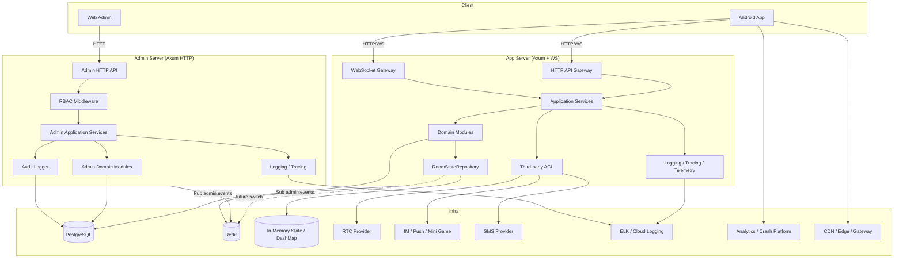

# 1. 文档目标

本文档定义实时语聊房项目的目标生产级架构，用于统一指导以下四端后续代码生成与业务开发：

- **App Server**：Rust + Axum + SQLx + PostgreSQL + Tungstenite（C 端业务后端，公网部署）
- **Admin Server**：Rust + Axum + SQLx + PostgreSQL（B 端管理后端，内网 VPN 部署）
- **Android**：Kotlin + Gradle 8.7 + Compose + Retrofit 2.11.0 + DataStore 1.1.1 + Paging3
- **Web (Admin)**：Vite + React + Ant Design + Zustand（后台管理系统）

本架构以以下原则为准：
1. **服务端权威**：房间、麦位、礼物、钱包等核心状态以 Server 为唯一事实源。
2. **DDD + 模块化**：按业务域拆分 bounded context，采用 Package by Feature，确保高内聚、低耦合。
3. **可替换外部依赖**：RTC、IM、小游戏、风控、支付、埋点、崩溃上报等第三方设施必须通过防腐层接入。
4. **商业化强一致性**：金币、收益、账单流水必须通过数据库事务保证一致。
5. **弱网可恢复**：核心链路必须具备心跳、重连、幂等、防重和状态回补能力，严格处理消息乱序。
6. **中东本土化优先**：架构初期即支持多语言、阿拉伯语 RTL、时区与本地化文案。
7. **多环境可切换**：本地开发、测试环境、生产环境必须通过统一配置体系管理，禁止硬编码环境变量。
8. **可观测与可排障**：关键链路必须具备结构化日志、链路追踪、客户端埋点、崩溃上报与在线检索能力。

---

# 2. 总体架构概览

## 2.1 分层原则

| 层级 | 职责 | 禁止事项 |
| --- | --- | --- |
| **Interface / Controller** | HTTP/WS 协议适配、参数校验、鉴权上下文提取 | 写业务规则、直接拼 SQL |
| **Application / Service** | 编排用例、事务边界、跨模块协作 | 持有 UI/SDK 细节 |
| **Domain** | 实体、值对象、领域规则、领域事件 | 依赖第三方 SDK |
| **Repository** | 数据访问抽象 | 承载复杂业务决策 |
| **Infrastructure** | DB、缓存、第三方 SDK 封装、日志、配置、埋点上报 | 泄露实现细节给上层 |
