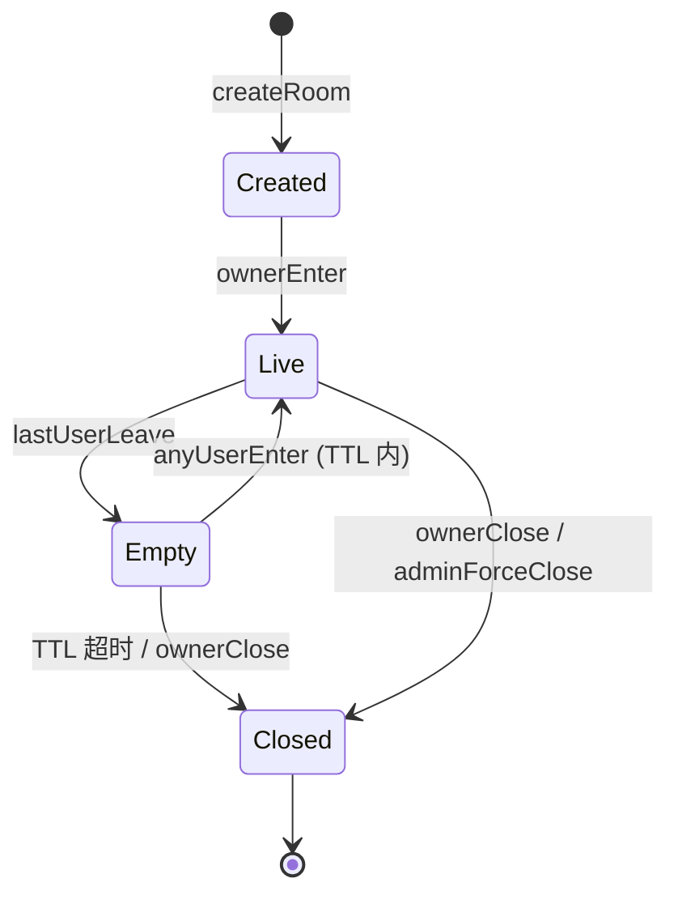
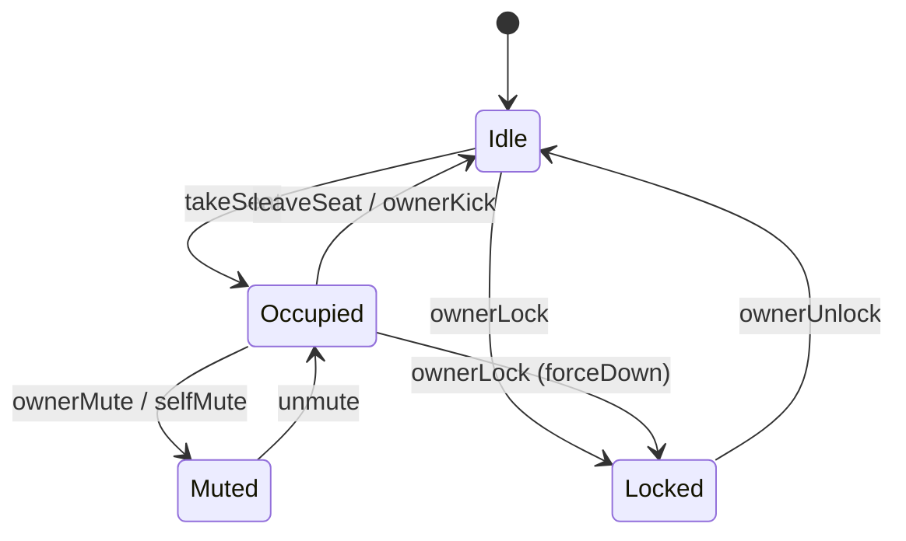
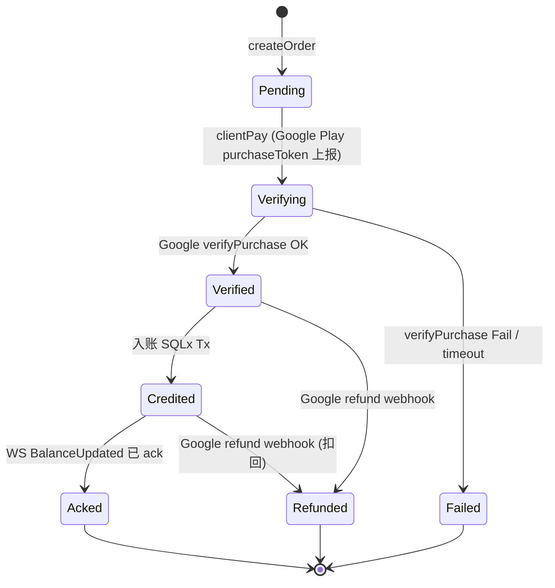
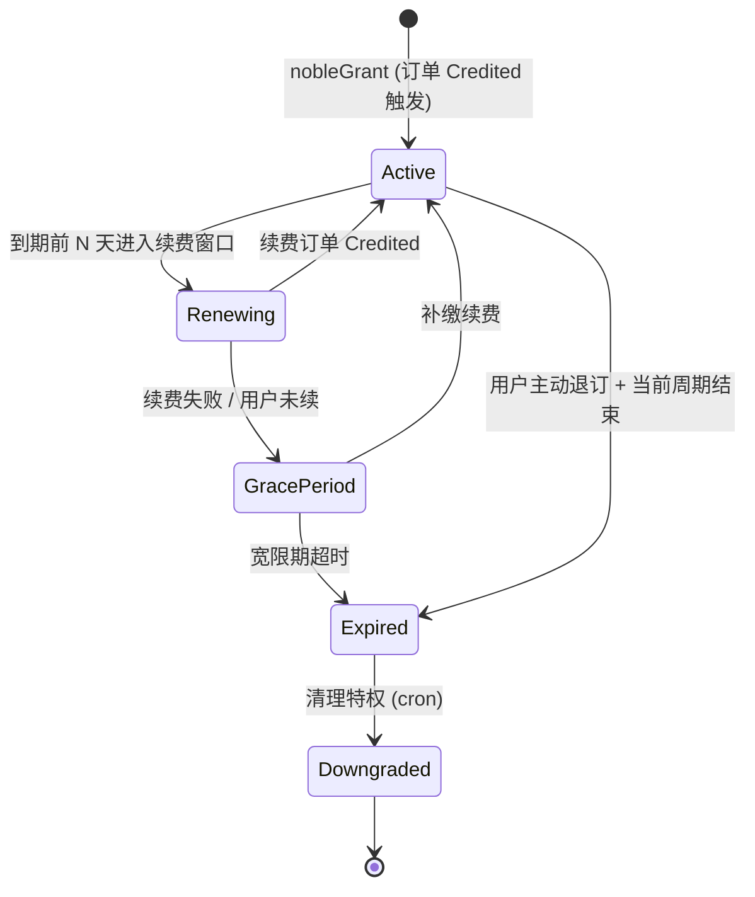
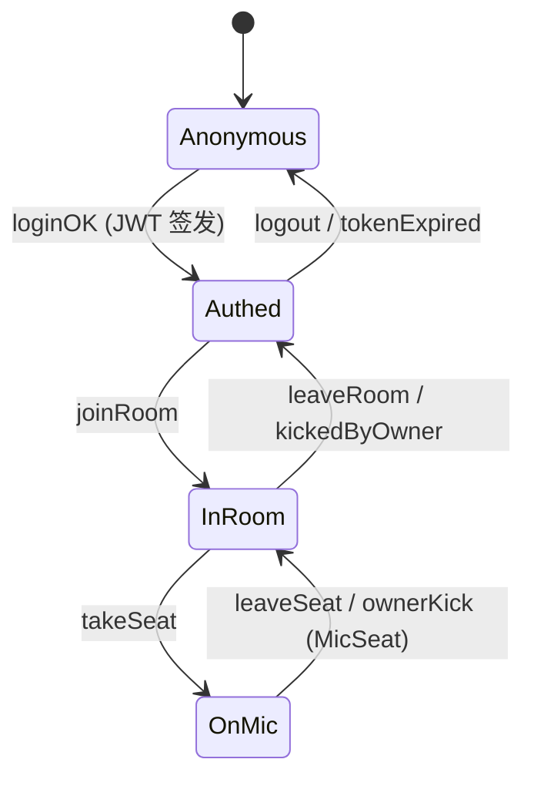
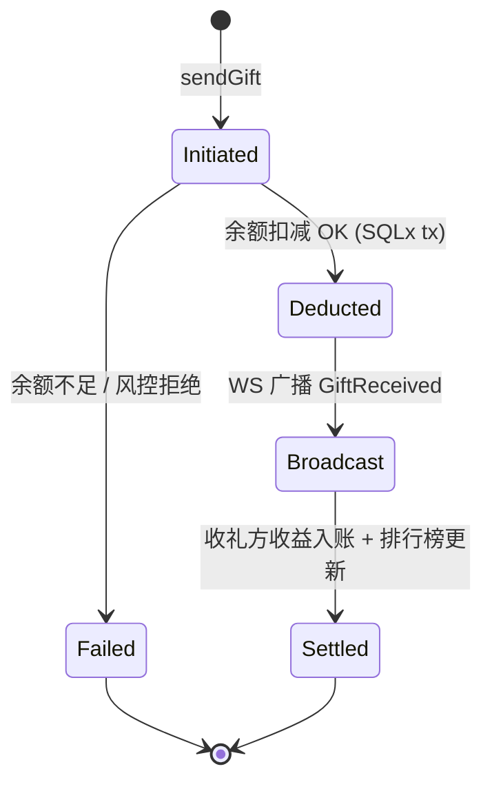

# 业务状态机总览 (Business State Machines)

> **作用**：产品边界类文档之一。本文件**唯一定义**核心业务实体的合法状态、合法迁移、守卫条件与副作用。
> **不重复**：字段定义 → `doc/protocol/`；实现细节 → `doc/tds/`；UI 表现 → `doc/design/`。
> **引用方式**：Spec / TDS / test-design 必须以本文件锚点为唯一事实源（如 `state_machines.md#room`）。

---

## 0. 阅读约定

- 所有状态机使用 Mermaid `stateDiagram-v2`。
- 每个状态机后跟一张「迁移对照表」，四列：**触发事件 / 守卫条件 / 副作用（WS 广播 + DB 写入） / UI 表现锚点**。
- 触发事件命名一律使用 `protocol/` 中的信令/接口名，禁止臆造。
- 守卫条件若涉及数值上限，必须引用 `business_constraints.md` 中的常量名。

---

## 1. Room（房间生命周期） 

| 触发事件 | 守卫条件 | 副作用 | UI 表现锚点 |
|---------|---------|--------|------------|
| `createRoom` | 用户未持有未关闭房间 | DB: `rooms` insert；Redis: `room:{id}:meta` | Android 跳转 `RoomActivity` |
| `ownerEnter` | 房主身份校验 | WS 广播 `RoomLive` | 房间卡片亮起 LIVE 标签 |
| `lastUserLeave` | 在线人数=0 | Redis: `room:{id}:state=Empty`，启动 TTL=`ROOM_EMPTY_TTL_SEC` | 卡片淡化 |
| `anyUserEnter` | TTL 未过期 | 取消 TTL，状态回 Live | 卡片恢复 |
| `ownerClose` / `adminForceClose` | 权限校验 | DB: `rooms.closed_at` 写入；WS 广播 `RoomClosed`；踢出全员 | 房间页跳回大厅 |

---

## 2. MicSeat（麦位） 

| 触发事件 | 守卫条件 | 副作用 | UI 表现锚点 |
|---------|---------|--------|------------|
| `takeSeat` | 座位 = Idle 且未被 Locked；用户未占其它座位 | Redis 抢锁；WS 广播 `MicTaken` | 头像入位动画 |
| `leaveSeat` | 占位者本人或房主 | WS 广播 `MicLeft` | 头像出位 |
| `ownerMute` | 操作者为房主/管理员 | WS 广播 `MicMuted`；RTC 取消推流权限 | 麦位红色禁麦图标 |
| `ownerLock` | 操作者为房主/管理员 | 若 Occupied 先强制下麦 | 锁形图标 |
| `ownerKick` | 操作者权限 + 目标已 Occupied | WS 广播 `MicKicked`；触发 24h 内禁上麦计数（见 `room_governance` spec） | 顶部 toast |

> ⚠️ 任何 MicSeat 迁移必须经过 Server 仲裁，客户端**禁止本地推断**（红线 1）。

---

## 3. Order（充值订单） 

| 触发事件 | 守卫条件 | 副作用 | UI 表现锚点 |
|---------|---------|--------|------------|
| `createOrder` | 商品 SKU 在售；用户未达充值上限 | DB: `orders` insert(state=Pending) | 充值面板 loading |
| `clientPay` | purchaseToken 非空 | 进入 Verifying；记录 `msg_id` 用于幂等 | Loading 文案 "校验中" |
| `verifyPurchase OK` | Google 返回 PURCHASED | Credited tx：`orders.state=Credited` + `wallets.balance += amount`（同一 SQLx tx，红线 2） | - |
| `BalanceUpdated ack` | 客户端回执 | DB: `orders.acked_at` | 余额数字滚动动画 |
| `refund webhook` | Google 签名校验通过 | 同事务回退余额；若余额不足允许负值并记 `refund_debt` | 钱包页负余额提示 |

> ⚠️ 状态变更必须基于 `msg_id` 去重；同一 purchaseToken 不得二次入账（红线 2）。

---

## 4. Noble（贵族订阅） 

| 触发事件 | 守卫条件 | 副作用 | UI 表现锚点 |
|---------|---------|--------|------------|
| `nobleGrant` | 订单 state=Credited | DB: `noble_subscriptions` insert；WS 广播 `NobleUpdated` | 贵族铭牌点亮 |
| 进入 `Renewing` | 当前周期剩余 ≤ `NOBLE_RENEW_WINDOW_DAYS` | 推送续费引导 | 钱包页 banner |
| 进入 `GracePeriod` | 到期且续费未成功 | 保留特权但标记 `grace=true` | 铭牌加灰边 |
| `Expired → Downgraded` | cron 扫描 | 清理：座驾/进场特效/聊天气泡禁用 | 铭牌消失 |

---

## 5. UserSession（用户在线/在房） 

| 触发事件 | 守卫条件 | 副作用 | UI 表现锚点 |
|---------|---------|--------|------------|
| `loginOK` | OTP/凭证验证通过 | JWT 签发；WS 鉴权握手 | 跳转首页 |
| `joinRoom` | 用户未被房间封禁 | WS 订阅 `room:{id}` 频道 | 进入 RoomActivity |
| `kickedByOwner` | 房主操作 | WS 广播 `UserKicked` + 24h 同房禁入 | toast "您已被请出房间" |
| `tokenExpired` | JWT exp ≤ now | 强制断 WS；落入登录页 | 登录页 |

---

## 6. GiftTransaction（礼物事务） 

| 触发事件 | 守卫条件 | 副作用 | UI 表现锚点 |
|---------|---------|--------|------------|
| `sendGift` | 礼物 SKU 在售；目标在房；连击 ≤ `GIFT_COMBO_MAX` | 进入 Initiated；`msg_id` 入幂等表 | 礼物面板 loading |
| `余额扣减 OK` | `wallets.balance ≥ price`（同 tx 内行锁） | DB: `gift_records` insert + `wallets` update（同一 SQLx tx，红线 2） | - |
| `Broadcast` | Deducted 完成 | WS 广播 `GiftReceived` 给房间全体 | 全屏特效 + 飘屏 |
| `Settled` | Broadcast ack 或异步 cron | DB: 收益分成入账 + 排行榜 ZINCRBY | 排行榜数字更新 |

> ⚠️ 任何金额变更必须落入单一 SQLx 事务，禁止"先扣后写日志"两步走（红线 2）。

---

## 附录 A：跨状态机联动矩阵

| 上游 | 下游 | 触发关系 |
|------|------|---------|
| Order.Credited | Noble.Active | 若 SKU 类型=贵族 |
| Order.Credited | UserSession (无变更) | 仅更新钱包余额 |
| MicSeat.Occupied → Idle (ownerKick) | UserSession 24h 同房禁上麦 | 入 `room_governance` 计数器 |
| Room.Closed | MicSeat 全部 → Idle | 级联清理 |
| Room.Closed | UserSession.InRoom → Authed | 全员踢出 |
| GiftTransaction.Settled | 排行榜状态机（未独立建模，简单 ZSET） | ZINCRBY |

---

## 附录 B：变更记录

| 版本 | 日期 | 摘要 |
|------|------|------|
| v1.0 | 2026-05-15 | 初版：6 大状态机 + 联动矩阵，作为产品边界类唯一事实源 |
