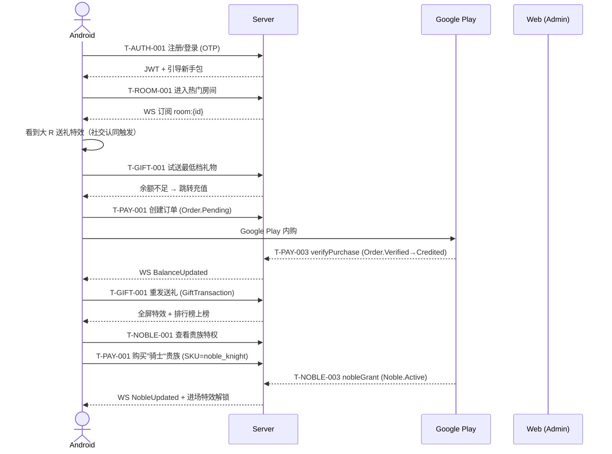
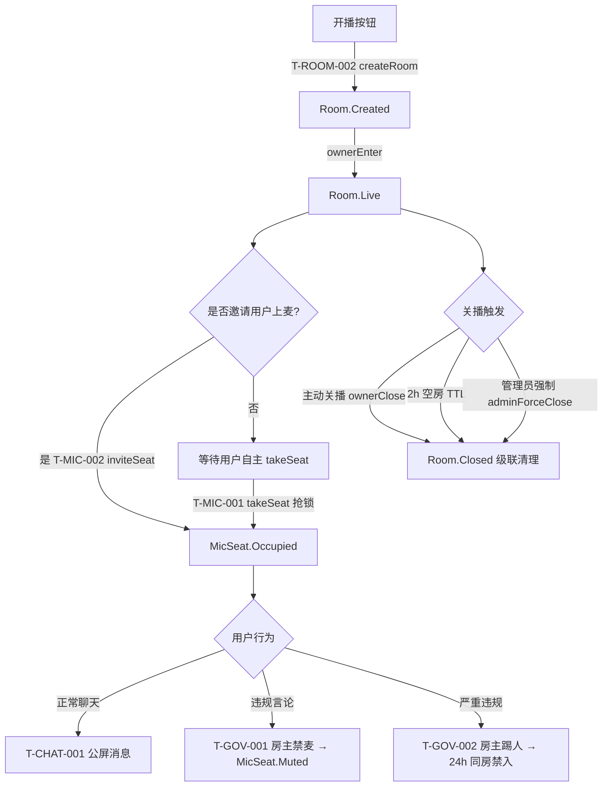
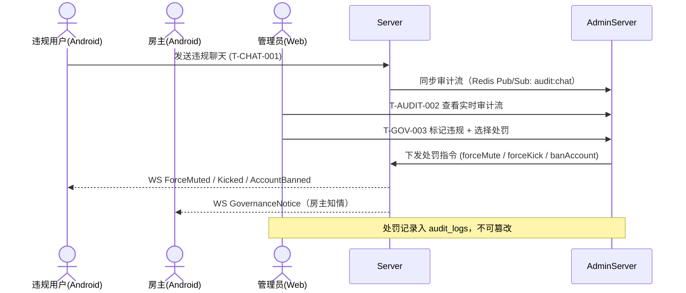
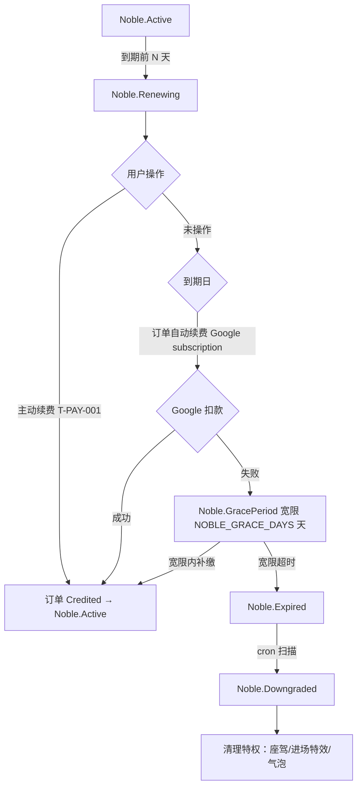
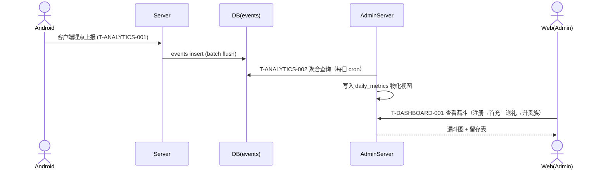

# 用户旅程总览 (User Journeys)

> **作用**：产品边界类文档之二。本文件**唯一定义**核心用户在跨 Epic / 跨端的完整决策链路。
> **不重复**：状态迁移 → `state_machines.md`；字段 → `doc/protocol/`；实现 → `doc/tds/`。
> **引用方式**：每个 Spec 在「§3 流程图」必须引用本文件对应锚点（如 `user_journeys.md#j1-recharge-gift-noble`），并在 Spec 内做"片段裁剪"。

---

## 0. 阅读约定

- 每条旅程使用 Mermaid `sequenceDiagram`（跨端时序）或 `flowchart`（决策分支）。
- 旅程节点必须标注：**触点 Task ID**（来自 `doc/tasks/index.md`） + **状态机锚点**（来自 `state_machines.md`）。
- 决策点（菱形）必须列出全部分支，**不留 happy-path-only**。
- 跨端切点用泳道（actor）区分：`Android` / `Web` / `Server` / `AdminServer` / `Google`。

---

## J1：新用户首充 → 送礼 → 升贵族 

**目标人群**：首日下载 App 的"潜在大 R"用户。
**业务价值**：首充转化 + ARPPU 提升。
**触点 Epic**：E-01 鉴权 / E-04 房间 / E-05 礼物 / E-08 充值 / E-09 贵族。

### 决策点

| 节点 | 决策 | 分支 A | 分支 B |
|------|------|--------|--------|
| OTP 验证 | 验证码是否正确 | 进入主页 | 失败 3 次锁定 5 分钟（见 `business_constraints.md#otp`） |
| 试送礼物 | 余额是否足够 | 直接 GiftTransaction.Initiated | 跳转充值面板 |
| Google verify | 凭证是否有效 | Order.Credited | Order.Failed → 客户端 toast |
| 充值上限 | 当日累计是否超 `DAILY_RECHARGE_CAP_USD` | 正常下单 | 拒绝 + 客服引导 |

### 跨端切点
- **Android ⇄ Server**：所有信令走 `wsClient.send` 或 Retrofit。
- **Server ⇄ Google**：服务端校验，**禁止客户端直传校验结果**（红线：单一事实源）。
- **Web (Admin)**：仅观测，T-AUDIT-001 接收订单流水审计事件。

---

## J2：房主开播 → 邀麦 → 互动 → 关播 

**目标人群**：内容生产者（女主播 / 游戏陪玩）。
**业务价值**：内容供给 + 房间留存。
**触点 Epic**：E-01 / E-03 麦位 / E-04 房间 / E-06 RTC / E-07 治理。

### 决策点

| 节点 | 决策 | 分支 |
|------|------|------|
| createRoom | 是否已有未关闭房间 | 否 → 创建；是 → 拒绝并返回原房 ID |
| takeSeat | 座位是否 Idle 且未 Locked | 抢锁成功 → Occupied；否 → toast "座位已被占用" |
| 禁麦 | 操作者权限 | 房主/管理员 → 通过；普通用户 → 403 |
| ownerClose | 房内剩余金币流水 | 立即结算 → Closed；异步结算礼物 settled 队列 |

### 异常流（必须覆盖）
- 房主断网：Server 检测 WS 心跳超时 `WS_HEARTBEAT_TIMEOUT_SEC`，进入"房主离线"宽限期，超时则 Room.Closed。
- RTC 推流失败：客户端重试 3 次后降级为"纯文字房"（不影响 Room.Live 状态）。

---

## J3：违规处置闭环 

**目标人群**：管理员 / 风控运营。
**业务价值**：社区健康度 + 合规。
**触点 Epic**：E-07 治理 / E-10 后台。

### 决策点

| 节点 | 决策 | 分支 |
|------|------|------|
| 风控等级 | 违规严重度 | L1 警告 / L2 禁麦 30 分钟 / L3 踢出 + 24h 禁入 / L4 封号 7 天 / L5 永封 |
| 申诉 | 用户是否提交申诉 | 是 → AdminServer 工单队列；否 → 处罚生效 |
| 误判回滚 | 管理员二审 | 撤销 → 状态回写；维持 → 不变 |

### 跨端切点
- **Server ⇄ AdminServer**：Redis Pub/Sub `audit:*` 频道，AdminServer **只订阅不写主库**（防腐层 + 红线 3）。
- **Web ⇄ AdminServer**：HTTP REST，所有操作落 `audit_logs` 表。

---

## J4：贵族过期 → 续费/降级 

**目标人群**：已购贵族用户。
**业务价值**：续费率 + LTV。
**触点 Epic**：E-08 / E-09。

### 决策点

| 节点 | 决策 | 分支 |
|------|------|------|
| 续费窗口 | 是否到达 `NOBLE_RENEW_WINDOW_DAYS` | 是 → 推送 banner；否 → 静默 |
| Google 扣款 | subscription 状态 | ACTIVE → 续约；ON_HOLD / CANCELED → GracePeriod |
| 降级时机 | Expired → Downgraded | cron 每日 03:00 UTC 扫描 |

### 异常流
- 退款（refund webhook）：Active 直接 → Downgraded，并写 `refund_debt`。
- 升级贵族档位：旧档位剩余时间按等价金额折算到新档位（见 `nobility_purchase` spec）。

---

## J5：埋点漏斗 → 数据看板 

**目标人群**：运营 / 数据分析师。
**业务价值**：决策依据。
**触点 Epic**：E-10 后台 / 全端埋点。

### 决策点

| 节点 | 决策 | 分支 |
|------|------|------|
| 埋点采样 | 事件类型 | 关键路径 100% / 普通行为 10% 抽样 |
| 聚合粒度 | 时间窗口 | 实时（最近 5 分钟） / T+1 日报 / T+7 周报 |

---

## 附录 A：旅程 × 状态机交叉表

| 旅程 | Room | MicSeat | Order | Noble | UserSession | GiftTransaction |
|------|------|---------|-------|-------|-------------|-----------------|
| J1 首充送礼升贵族 |  |  | ✅ | ✅ | ✅ | ✅ |
| J2 房主开播闭环 | ✅ | ✅ |  |  | ✅ |  |
| J3 违规治理 | (踢出) | (禁麦) |  |  | ✅ |  |
| J4 贵族续费 |  |  | ✅ | ✅ |  |  |
| J5 埋点漏斗 | (事件) |  | (事件) | (事件) | (事件) | (事件) |

---

## 附录 B：变更记录

| 版本 | 日期 | 摘要 |
|------|------|------|
| v1.0 | 2026-05-15 | 初版：5 条核心旅程 + 状态机交叉表 |
