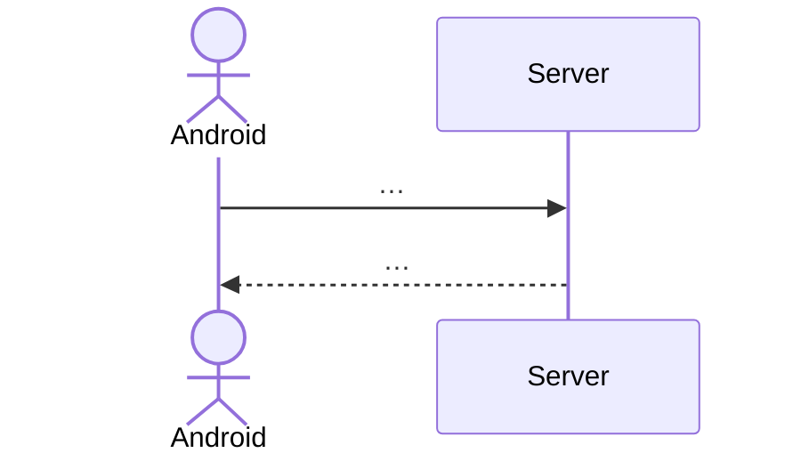

<!--
[AI 写入规约]
1. 本目录由 PM Agent 维护，作为「功能簇 (Feature Cluster)」级产品规约。
2. 粒度：每份 Spec 聚合 3–8 个相关 Task；不写到 Epic 级（太粗），不写到 Task 级（太细）。
3. 角色边界：
   - Spec **不重复**字段定义（→ doc/protocol/）
   - Spec **不写**实现细节（→ doc/tds/）
   - Spec **不画**像素稿（→ doc/design/）
   - Spec **只**做"聚合 + 裁剪 + 验收"：聚合状态机/旅程/约束，裁剪本功能片段，给出 GWT 验收。
4. 命名：`doc/specs/<feature_snake_case>.md`，feature 名取自 product/index.md 的"功能簇"列表。
5. Plan Agent 开 TDS 时必须从对应 Spec §5 GWT 复制条款到 TDS §0，禁止改写。
6. test-design Agent 编写测试用例时输入 = Spec + 关联 Journey + 关联 Constraints + 关联 StateMachines。
-->

# Spec: <功能簇中文名> (<feature_snake_case>)

> **状态**：草稿 | 已锁定 | 已归档
> **覆盖 Epic**：E-XX
> **最后更新**：YYYY-MM-DD

---

## §1 关联 Task 簇

本 Spec 覆盖以下 Task（来自 `doc/tasks/index.md`）：

| Task ID | 端 | 一句话目标 | 状态 |
|---------|----|----------|------|
| T-XXX-001 | Server | …… | Done / WIP / Plan |
| T-XXX-002 | Android | …… | …… |

> 若 Task 在 `tasks/index.md` 中调整，必须同步本表。

---

## §2 事实源锚点（Single Source of Truth Links）

> 本 Spec **不重复**这些事实源的内容，仅引用。

### 协议契约（doc/protocol/）
- HTTP REST：[`protocol/xxx_api.md#section`](../protocol/xxx_api.md)
- WebSocket：[`protocol/websocket_signals.md#section`](../protocol/websocket_signals.md)
- Redis Pub/Sub：[`protocol/pubsub_channels.md#section`](../protocol/pubsub_channels.md)

### 状态机（doc/product/state_machines.md）
- 主状态机：[`state_machines.md#xxx`](../product/state_machines.md#xxx)
- 联动状态机（如有）：……

### 业务约束（doc/product/business_constraints.md）
- 引用的常量名清单（grep-able）：
  - `CONSTANT_A`、`CONSTANT_B`、……

### 用户旅程（doc/product/user_journeys.md）
- 主旅程：[`user_journeys.md#jX-xxx`](../product/user_journeys.md#jX-xxx)
- 本 Spec 对应的旅程"片段"：从节点 N1 到节点 N7。

---

## §3 流程图（裁剪后）

> 从总旅程中**裁剪**与本功能簇相关的片段，禁止重画完整旅程。

### 异常分支必覆清单
- [ ] 断网 / WS 重连
- [ ] 权限拒绝（401/403）
- [ ] 并发冲突（同 msg_id / 同资源抢占）
- [ ] 服务端 5xx 兜底
- [ ] 客户端校验失败兜底
- [ ] 本功能簇特有异常：……

---

## §4 边界不变量（Invariants）

> 用一句话陈述"任何时候都必须为真"的产品约束，禁止用"应该 / 一般"。每条不变量必须可被测试断言。

- **INV-1**：…（如：同一 purchaseToken 不可重复入账）
- **INV-2**：…
- **INV-3**：…

> 不变量违例 = P0 缺陷，Review 必判 P0。

---

## §5 验收条款（Given-When-Then）

> ⚠️ **Plan Agent 创建 TDS 时必须把本节对应 Task 的 GWT 逐字复制到 TDS §0。**
> 每条 GWT 必须可被一条自动化测试断言。

### 通用前置（Given）
- 应用版本 ≥ vX.Y
- 用户已 …
- 房间 / 订单 / 钱包初始状态 …

### Task 级 GWT

#### T-XXX-001
- **GWT-1**：
  - **Given** ……
  - **When** ……
  - **Then** ……（必须断言：状态机迁移 + WS 广播 + DB 写入 + UI 锚点四选 N）
- **GWT-2**：（异常分支）
  - **Given** ……
  - **When** ……
  - **Then** ……

#### T-XXX-002
- **GWT-1**：……

---

## §6 变更记录

| 版本 | 日期 | 摘要 |
|------|------|------|
| v1.0 | YYYY-MM-DD | 初版 |
