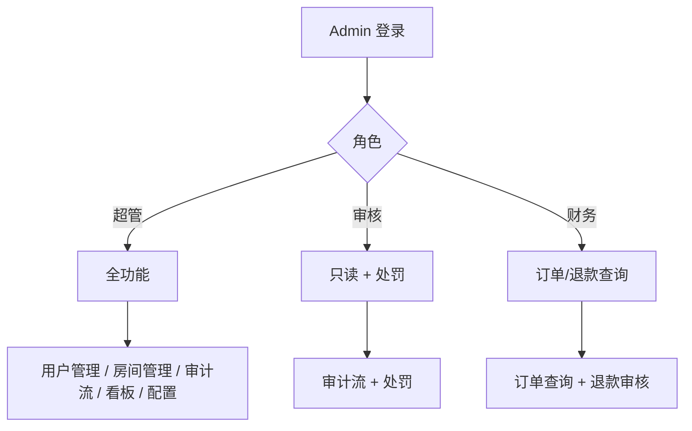

# Spec: 管理后台仪表盘 (admin_dashboard)

> **状态**：已归档
> **覆盖 Epic**：E-06 Web 管理端增强
> **最后更新**：2026-05-15

---

## §1 关联 Task 簇

[`doc/tasks/模块5-Web 管理端增强 (Admin Web Enhancements).md`](../tasks/模块5-Web%20管理端增强%20(Admin%20Web%20Enhancements).md)：登录鉴权 / 用户列表 / 房间列表 / 审计流 / 处罚操作 / 数据看板入口。

---

## §2 事实源锚点

- 协议：[`protocol/admin_api.md`](../protocol/admin_api.md)
- 状态机：N/A（管理后台无独立业务状态机；操作落 audit_logs）
- 旅程：[`user_journeys.md#j3-governance`](../product/user_journeys.md#j3-governance)、[`user_journeys.md#j5-analytics-funnel`](../product/user_journeys.md#j5-analytics-funnel)
- 业务约束：`JWT_ACCESS_TTL_SEC`（管理员 token 可短至 30 分钟，本 Spec 内单独覆盖）

---

## §3 流程图（裁剪后）

### 异常分支必覆清单
- [x] 角色越权 → 403 + 审计 `admin_unauthorized`
- [x] Admin token 过期 → 强制重新登录
- [x] 关键操作（封号 / 退款）需二次确认 + 操作日志
- [x] 列表分页越界 / 排序非法字段 → 400
- [x] AdminServer 写主库 → P0（同 room_governance INV-V1）

---

## §4 边界不变量

- **INV-D1**：Admin 角色权限矩阵以代码 `roles.rs` 为唯一事实源，UI 隐藏菜单**不等同于**后端鉴权（必须双重校验）。
- **INV-D2**：所有"写"操作必须记 `audit_logs`，包含操作者 ID / 时间 / IP / 目标对象。
- **INV-D3**：仪表盘指标 SQL 必须走 `daily_metrics` 物化视图，**禁止**对业务主表实时大查询。

---

## §5 验收条款（GWT）

### GWT-D1（角色权限）
- **Given** 审核角色 token
- **When** 调用 `POST /admin/refund`
- **Then** 返回 403；audit_logs 写入 `admin_unauthorized`

### GWT-D2（关键操作二次确认）
- **Given** 超管点击"封号 7 天"按钮
- **When** 未确认对话框
- **Then** 不发送请求；确认后才发送 + 记审计

### GWT-D3（仪表盘性能）
- **Given** 日活用户 100 万
- **When** 查看"今日漏斗"
- **Then** 响应 ≤ 500ms（查 `daily_metrics`，不查 `events` 原始表）

---

## §6 变更记录

| 版本 | 日期 | 摘要 |
|------|------|------|
| v1.0 | 2026-05-15 | 初版归档 |
