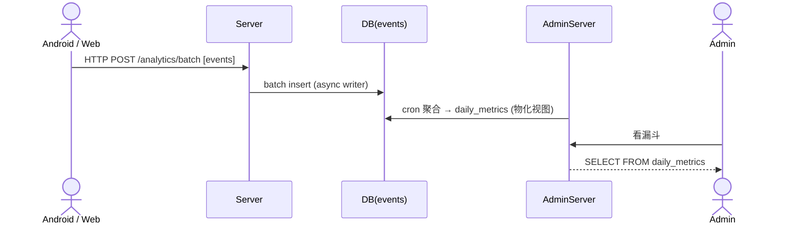

# Spec: 埋点漏斗与数据看板 (analytics_funnel)

> **状态**：已归档
> **覆盖 Epic**：E-07.5 埋点与观测性基建
> **最后更新**：2026-05-15

---

## §1 关联 Task 簇

[`doc/tasks/模块7-埋点与观测性基建 (E-07.5).md`](../tasks/模块7-埋点与观测性基建%20(E-07.5).md)：客户端 SDK / Server 收口 / events 表 / 物化视图 / Web 漏斗看板。

---

## §2 事实源锚点

- 协议：[`protocol/analytics_api.md`](../protocol/analytics_api.md)（如不存在，回 `admin_api.md` 中的 events 章节）
- 状态机：N/A（埋点为事件流，无状态机）
- 旅程：[`user_journeys.md#j5-analytics-funnel`](../product/user_journeys.md#j5-analytics-funnel)
- 业务约束：埋点采样规则（关键路径 100% / 普通 10%）；批量上报窗口 ≤ 5s 或 ≤ 100 条；事件保留 ≥ 90 天

---

## §3 流程图（裁剪后）

### 异常分支必覆清单
- [x] 事件 schema 不合法 → server 拒绝单条 + 不影响其他
- [x] events 写入失败 → 客户端本地队列重试（背压保护）
- [x] 时钟漂移：以 server `received_at` 为聚合时间基准，`client_ts` 仅记录
- [x] 用户撤销同意（GDPR/MENA 类似法规）→ 停止采集 + 删除 PII
- [x] 批量大小超限 → 拆分 / 拒绝

---

## §4 边界不变量

- **INV-N1**：所有埋点事件 schema 在 `doc/protocol/analytics_api.md` 中**唯一**定义，禁止客户端自由扩展字段。
- **INV-N2**：PII（手机号、IP、设备 ID）必须在 server 端脱敏或 hash 后入库，禁止明文存储到 events。
- **INV-N3**：仪表盘查询**禁止**对 `events` 表实时大窗口扫描；必须走 `daily_metrics` 物化视图（与 admin_dashboard INV-D3 一致）。
- **INV-N4**：客户端本地队列上限（如 1000 条）必须背压，超出丢弃旧关键级别外的事件并打点 `analytics_drop`。

---

## §5 验收条款（GWT）

### GWT-N1（schema 校验）
- **Given** 客户端上报含未注册事件 `event_name=foo_bar`
- **When** Server 校验
- **Then** 拒绝该条事件；返回 partial-success；该批其他事件正常入库

### GWT-N2（断网回放）
- **Given** 客户端离线，本地队列累积 500 条
- **When** 网络恢复
- **Then** 按批量窗口上报；server `received_at` 为当前时间；`client_ts` 保留原值

### GWT-N3（PII 脱敏）
- **Given** 客户端误传手机号字段
- **When** Server 入库
- **Then** 字段被 SHA-256 hash 或丢弃；events 表 grep 原始手机号零结果

### GWT-N4（看板性能）
- **Given** 30 天事件 5 亿条
- **When** 查"7 天注册→首充漏斗"
- **Then** 响应 ≤ 800ms（走物化视图）

---

## §6 变更记录

| 版本 | 日期 | 摘要 |
|------|------|------|
| v1.0 | 2026-05-15 | 初版归档 |
