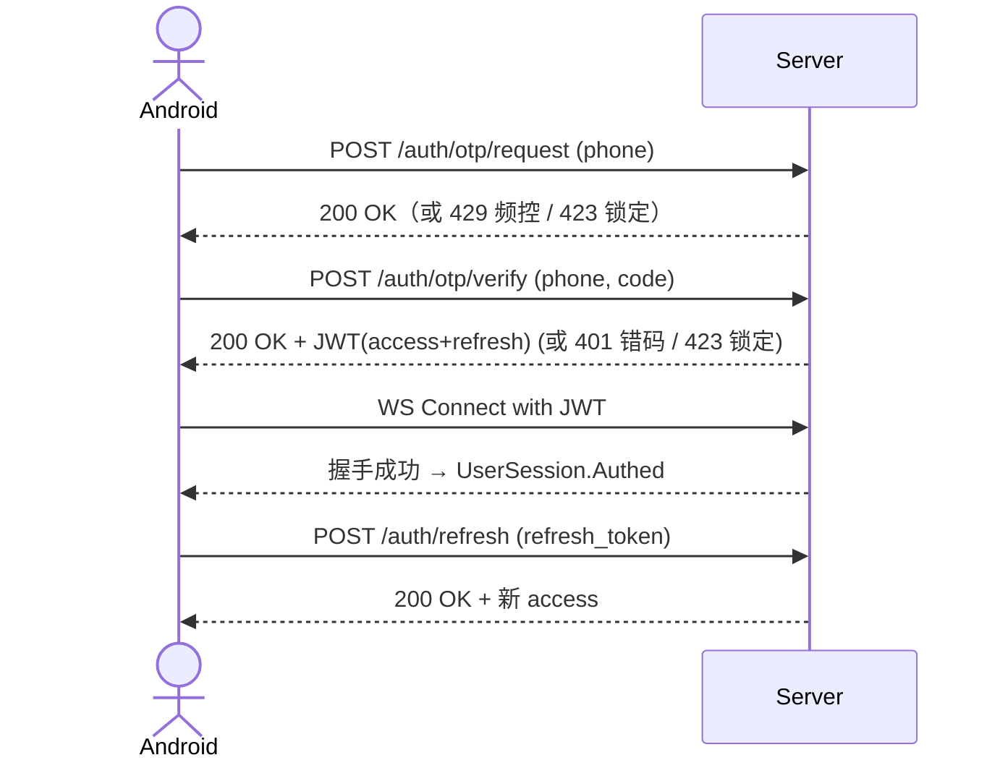

# Spec: 鉴权与登录 (auth_login)

> **状态**：已归档（历史功能簇）
> **覆盖 Epic**：E-01 用户认证系统
> **最后更新**：2026-05-15
> **说明**：本 Spec 为历史功能簇的事后归档，旨在统一为后续 test-design / 回归测试提供事实源锚点。已 Done 的 TDS 不回填 §0；新增 Task 必须遵循本 Spec。

---

## §1 关联 Task 簇

详见 [`doc/tasks/模块1-用户认证系统 (User Authentication).md`](../tasks/模块1-用户认证系统%20(User%20Authentication).md)。

核心 Task（节选）：
- 注册 / 登录 / OTP 发码 / OTP 校验 / JWT 签发 / Token 刷新 / 登出
- 失败锁定 / 速率限制 / WS 握手鉴权

---

## §2 事实源锚点

- 协议：[`protocol/auth_api.md`](../protocol/auth_api.md)、[`protocol/websocket_signals.md`](../protocol/websocket_signals.md)（握手段）
- 状态机：[`state_machines.md#user-session`](../product/state_machines.md#user-session)
- 旅程：[`user_journeys.md#j1-recharge-gift-noble`](../product/user_journeys.md#j1-recharge-gift-noble)（J1 起点）
- 业务约束：
  - `OTP_REQUEST_INTERVAL_SEC` / `OTP_MAX_ATTEMPTS_PER_DAY` / `OTP_VERIFY_MAX_FAILS` / `OTP_LOCK_DURATION_SEC` / `OTP_CODE_TTL_SEC`
  - `JWT_ACCESS_TTL_SEC` / `JWT_REFRESH_TTL_SEC`
  - `LOGIN_FAIL_LOCK_THRESHOLD` / `LOGIN_FAIL_LOCK_DURATION_SEC`
  - `PHONE_REGEX_MENA` / `NICKNAME_REGEX` / `NICKNAME_MAX_CHARS`

---

## §3 流程图（裁剪后）

### 异常分支必覆清单
- [x] OTP 频控 / 单日上限 / 锁定
- [x] 验证码过期 / 验证失败 N 次锁定
- [x] JWT 过期 / refresh 失败 → 回 Anonymous
- [x] WS 握手鉴权失败
- [x] 手机号格式不符 `PHONE_REGEX_MENA`

---

## §4 边界不变量

- **INV-A1**：同一手机号 `OTP_REQUEST_INTERVAL_SEC` 内不可获得二次验证码。
- **INV-A2**：验证码 `OTP_CODE_TTL_SEC` 之后**必须**失效，不可二次使用。
- **INV-A3**：连续 `OTP_VERIFY_MAX_FAILS` 次错误必须触发 `OTP_LOCK_DURATION_SEC` 锁定。
- **INV-A4**：JWT 必须包含 `sub`/`exp`/`iat`，过期后任何受保护接口必须 401。
- **INV-A5**：WS 鉴权失败的连接必须在握手阶段断开，禁止进入 `Authed`。

---

## §5 验收条款（GWT）

> 历史 Task 已 Done；本节用于 **新增 Task** 与 **回归测试**。

### GWT-A1（OTP 频控）
- **Given** 手机号 `+966500000100` 刚获取验证码 30 秒前
- **When** 再次请求验证码
- **Then** 返回 429；DB 不新增 `otp_records`

### GWT-A2（验证失败锁定）
- **Given** 手机号已连续输错 `OTP_VERIFY_MAX_FAILS - 1` 次
- **When** 再次输入错误验证码
- **Then** 返回 423 + 锁定剩余秒数；Redis `auth:lock:{phone}` TTL = `OTP_LOCK_DURATION_SEC`

### GWT-A3（JWT 过期 + refresh）
- **Given** access_token 已过期，refresh_token 仍有效
- **When** 客户端调任意受保护接口收到 401，自动调 `/auth/refresh`
- **Then** 拿到新 access_token；UserSession 保持 `Authed`

### GWT-A4（WS 握手鉴权）
- **Given** WS 连接握手时携带伪造 JWT
- **When** 服务端校验
- **Then** 握手 4001 断开；客户端落入登录页（`UserSession → Anonymous`）

---

## §6 变更记录

| 版本 | 日期 | 摘要 |
|------|------|------|
| v1.0 | 2026-05-15 | 初版归档，锚点对齐 protocol/auth_api.md |
