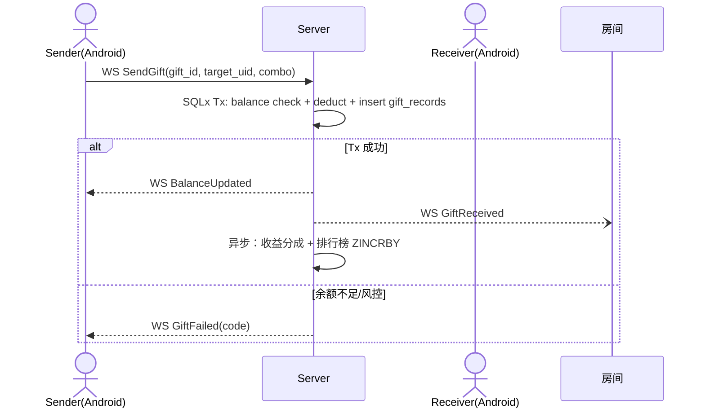

# Spec: 礼物经济与钱包 (gift_economy)

> **状态**：已归档
> **覆盖 Epic**：E-07 虚拟礼物与钱包闭环 MVP
> **最后更新**：2026-05-15

---

## §1 关联 Task 簇

[`doc/tasks/模块6-虚拟礼物与钱包闭环 MVP (E-07).md`](../tasks/模块6-虚拟礼物与钱包闭环%20MVP%20(E-07).md)。

---

## §2 事实源锚点

- 协议：[`protocol/gift_api.md`](../protocol/gift_api.md)、[`protocol/websocket_signals.md`](../protocol/websocket_signals.md)（GiftReceived / BalanceUpdated）
- 状态机：[`state_machines.md#gift-transaction`](../product/state_machines.md#gift-transaction)
- 旅程：[`user_journeys.md#j1-recharge-gift-noble`](../product/user_journeys.md#j1-recharge-gift-noble)
- 业务约束：`GIFT_MIN_PRICE_GOLD` / `GIFT_MAX_PRICE_GOLD` / `GIFT_COMBO_MAX` / `GIFT_COMBO_WINDOW_MS` / `REFUND_NEGATIVE_BALANCE_LIMIT_GOLD`

---

## §3 流程图（裁剪后）

### 异常分支必覆清单
- [x] 余额不足 → 拒绝 + 引导充值
- [x] 目标用户不在房 → 拒绝
- [x] 同 `msg_id` 重发 → 幂等（仅扣一次）
- [x] 连击超过 `GIFT_COMBO_MAX` → 截断
- [x] 风控命中（异常大额连击）→ 拒绝 + 审计

---

## §4 边界不变量

- **INV-G1**：金额扣减 + `gift_records` insert + `wallets.balance` update 必须在**同一 SQLx 事务**完成，禁止两步走（红线 2）。
- **INV-G2**：同 `msg_id` 必须幂等；幂等表保留 ≥ 7 天。
- **INV-G3**：广播 `GiftReceived` 顺序必须 = Deducted 完成顺序（防止特效错位）。
- **INV-G4**：客户端**不得**根据本地余额预渲染礼物特效；必须等待 Server 广播被动渲染（红线 1）。

---

## §5 验收条款（GWT）

### GWT-G1（事务原子性）
- **Given** 用户余额 = 礼物单价 + 1
- **When** 并发发 2 个相同礼物（不同 msg_id）
- **Then** 只有 1 个成功（DB 行锁）；另 1 个返回余额不足；DB 余额最终 = 1

### GWT-G2（幂等）
- **Given** 客户端因网络抖动以同一 msg_id 重发
- **When** Server 收到
- **Then** 仅扣减 1 次；仅广播 1 次

### GWT-G3（连击合并）
- **Given** 用户在 `GIFT_COMBO_WINDOW_MS` 内连击 5 次
- **When** Server 聚合
- **Then** 广播 1 条 `GiftReceived` 含 combo=5；扣减 5 倍单价

### GWT-G4（退款负余额）
- **Given** 充值订单被 Google 退款，且当前余额 < 退款金额
- **When** refund webhook 处理
- **Then** 余额回退至负值，但不得低于 `REFUND_NEGATIVE_BALANCE_LIMIT_GOLD`；超出转人工

---

## §6 变更记录

| 版本 | 日期 | 摘要 |
|------|------|------|
| v1.0 | 2026-05-15 | 初版归档 |
