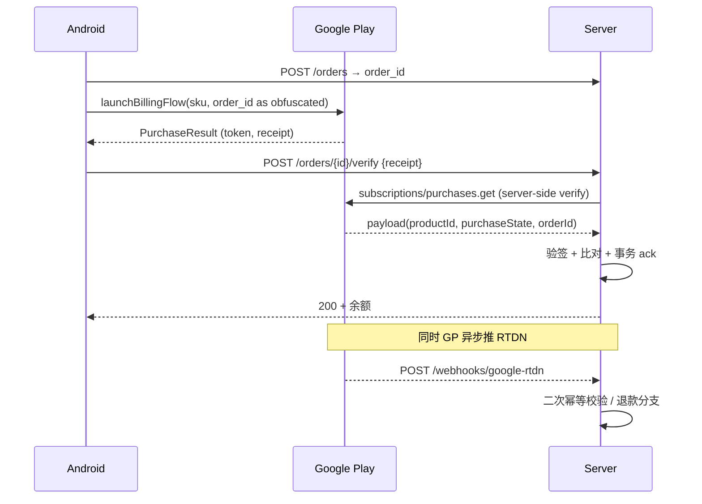

# Spec: Google Play 计费 (google_play_billing)

> **状态**：活跃（覆盖 E-08 中 Google Play 集成与验签）
> **覆盖 Task 簇**：Billing 防腐层、创建订单 + 唤起 Billing、客户端 verify+ack、Server 验签 + 入账强事务、RTDN 推送对账与退款
> **最后更新**：2026-05-15

---

## §1 关联 Task 簇

[`doc/tasks/模块10-E-08 充值订单与 Google Play 计费.md`](../tasks/模块10-E-08%20充值订单与%20Google%20Play%20计费.md)

| 端 | TaskID | 一句话职责 |
|---|---|---|
| server | T-00052 | Google Play 验签 + 入账强事务 [P0] |
| server | T-00053 | RTDN 推送对账 + 退款处理 |
| android | T-30061 | Billing 防腐层（BillingPort） |
| android | T-30062 | 创建订单 + 唤起 Billing |
| android | T-30063 | 客户端 verify + ack + 容错 |

---

## §2 事实源锚点

- 协议：[`protocol/billing_api.md`](../protocol/billing_api.md)（含 RTDN webhook schema）
- 状态机：[`state_machines.md#order`](../product/state_machines.md#order)（Order: Pending → Paying → Verified → Credited / Refunded）
- 旅程：[`user_journeys.md#j1-recharge-gift-noble`](../product/user_journeys.md#j1-recharge-gift-noble)
- 业务约束：
  - 验签公钥版本至少滚动支持 N 与 N-1
  - RTDN 重试窗口 ≥ 7 天（Google 默认）
  - 客户端 ack 最大重试次数 `BILLING_ACK_MAX_RETRY`
  - Billing 接入红线 = 防腐层（红线 3）

---

## §3 流程图（裁剪后）

### 异常分支必覆清单
- [x] 客户端 ack 失败 → 本地重试 ≤ `BILLING_ACK_MAX_RETRY` + 列表"待入账"
- [x] 客户端崩溃 → 下次启动扫描 unfinished purchases 重试
- [x] RTDN 早于客户端 ack 到达 → server 必须以 RTDN 为准入账（幂等）
- [x] RTDN 退款事件 → 触发 order Refunded + wallet 回退（与 ranking_leaderboard INV-L3 联动）
- [x] 直接调用 `BillingClient` 业务代码 → P0（必须经 BillingPort）

---

## §4 边界不变量

- **INV-B1**：所有 Google Play API 调用必须经 `BillingPort` 防腐层；业务层禁止 import `com.android.billingclient.*`（红线 3 / grep-able）。
- **INV-B2**：验签**必须**在 server 端进行（用 service account），禁止信任客户端 receipt 验证。
- **INV-B3**：入账（钱包到账 + order state 更新）必须在**一个 SQLx 事务**中（红线 2）。
- **INV-B4**：RTDN 与 client ack 必须共用同一 `provider_order_id` 幂等键；先到者写入，后到者返回 200 no-op。
- **INV-B5**：退款逆向流程禁止删除原订单/钱包记录，**追加** reverse 记录。

---

## §5 验收条款（GWT）

### GWT-B1（防腐层 grep）
- **Given** Android 代码库
- **When** `grep -r "com.android.billingclient" app/src/main` 排除 `BillingPort` 实现
- **Then** 零结果

### GWT-B2（验签拦截伪造）
- **Given** 客户端伪造 receipt（修改 productId）
- **When** server 调用 Google API 反查
- **Then** 比对失败 → 拒绝入账 + 审计 `billing_verify_failed`

### GWT-B3（RTDN 早到幂等）
- **Given** RTDN 先于 client ack 到达
- **When** 后续 client ack 调用
- **Then** server 返回 200 + 当前 wallet 余额；不重复入账

### GWT-B4（退款回退）
- **Given** 订单已 Credited（用户余额 +1000 金币）
- **When** Google 推送退款 RTDN
- **Then** 新增 reverse wallet_change -1000；order state=Refunded；ranking 同步回退（联动 ranking_leaderboard GWT-L3）

### GWT-B5（事务原子性）
- **Given** 入账过程中 DB 故障（wallet_change 已写，order update 未写）
- **When** 事务回滚
- **Then** wallet_change 也回滚；后续重试 ack 时 wallet 余额未变化

---

## §6 变更记录

| 版本 | 日期 | 摘要 |
|------|------|------|
| v1.0 | 2026-05-15 | 初版 |
