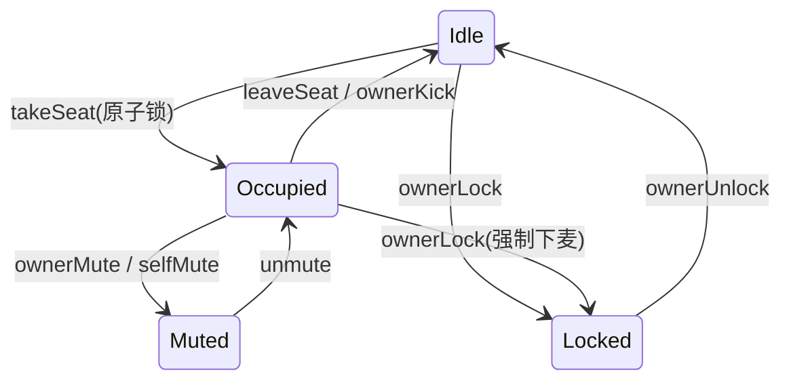

# Spec: 麦位系统 (mic_seat)

> **状态**：已归档
> **覆盖 Epic**：E-03 房间内核心 - 麦位
> **最后更新**：2026-05-15

---

## §1 关联 Task 簇

[`doc/tasks/模块3-房间内核心功能 (In-Room Core).md`](../tasks/模块3-房间内核心功能%20(In-Room%20Core).md) 中麦位相关 Task：takeSeat / leaveSeat / ownerMute / unmute / ownerLock / unlock / ownerKick / 麦位 UI 绑定。

---

## §2 事实源锚点

- 协议：[`protocol/websocket_signals.md`](../protocol/websocket_signals.md)（TakeSeat/LeaveSeat/MicTaken/MicLeft/MicMuted/MicLocked/MicKicked）
- 状态机：[`state_machines.md#mic-seat`](../product/state_machines.md#mic-seat)
- 旅程：[`user_journeys.md#j2-host-room-lifecycle`](../product/user_journeys.md#j2-host-room-lifecycle)
- 业务约束：`ROOM_MAX_MIC_SEATS` / `MIC_KICK_BAN_HOURS`

---

## §3 流程图（裁剪后）

### 异常分支必覆清单
- [x] 并发 takeSeat：必须只有一个成功
- [x] 用户已在其它座位：拒绝再次抢麦
- [x] 座位 Locked / Muted：拒绝 takeSeat
- [x] 非房主/管理员调 ownerMute/Lock/Kick：返回 403
- [x] 被 ownerKick 用户 24h 内重新 takeSeat：拒绝

---

## §4 边界不变量

- **INV-M1**：单房间麦位数 = `ROOM_MAX_MIC_SEATS`（房主 1 + 嘉宾 8），编号 `[0..8]`。
- **INV-M2**：单用户同房间最多占 1 个 MicSeat。
- **INV-M3**：MicSeat 任意迁移必须由 Server 仲裁，客户端禁止本地推断（红线 1：单一事实源）。
- **INV-M4**：takeSeat 在 Redis 必须使用原子操作（SET NX 或 Lua 脚本），禁止"读-改-写"非原子序列。
- **INV-M5**：Room.Closed 时所有 MicSeat 必须 → Idle。

---

## §5 验收条款（GWT）

### GWT-M1（并发抢麦）
- **Given** 座位 Idle，10 个用户同时调 takeSeat
- **When** Server 处理
- **Then** 恰好 1 个用户返回 200 + MicSeat → Occupied；其余返回 409；广播 1 条 `MicTaken`

### GWT-M2（同用户多座位禁止）
- **Given** 用户 U 已 Occupied 座位 #2
- **When** U 调 takeSeat(#5)
- **Then** 返回 409 + 错码 `ALREADY_ON_MIC`；座位 #5 仍 Idle

### GWT-M3（房主禁麦）
- **Given** 用户 V 在座位 #3 = Occupied
- **When** 房主调 ownerMute(seat=3)
- **Then** seat#3 → Muted；广播 `MicMuted`；RTC 推流权限被取消

### GWT-M4（踢麦 24h 禁入）
- **Given** 用户 V 被 ownerKick
- **When** 1 小时后 V 在同房间调 takeSeat
- **Then** 返回 423 + 剩余禁入秒数（来自 `MIC_KICK_BAN_HOURS`）

---

## §6 变更记录

| 版本 | 日期 | 摘要 |
|------|------|------|
| v1.0 | 2026-05-15 | 初版归档 |
