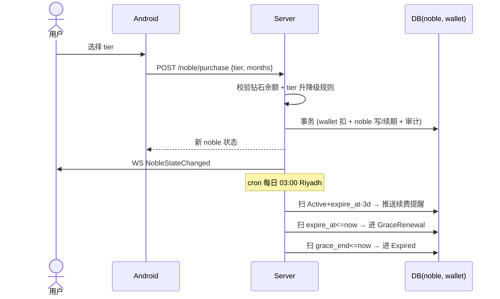

# Spec: 贵族购买 (nobility_purchase)

> **状态**：活跃（覆盖 E-09 贵族购买与续期）
> **覆盖 Task 簇**：贵族 Schema 与种子、贵族列表、钻石购买/续费 API、cron 续费/过期、AdminServer 手动赠送/撤销、Android 贵族中心页与续费提醒、Web 贵族管理与用户贵族 Tab
> **最后更新**：2026-05-15

---

## §1 关联 Task 簇

[`doc/tasks/模块11-E-09 贵族体系.md`](../tasks/模块11-E-09%20贵族体系.md)（共享）

| 端 | TaskID | 一句话职责 |
|---|---|---|
| server | T-00065 | 贵族 Schema 与种子 |
| server | T-00066 | 贵族列表 API |
| server | T-00067 | 钻石购买/续费 API（强事务） |
| server | T-00068 | 续费/过期 cron |
| adminServer | T-10030 | 贵族 tier CRUD API |
| adminServer | T-10031 | 手动赠送/撤销贵族 API |
| adminServer | T-10032 | Admin 贵族用户查询 API |
| android | T-30070 | 贵族中心页（列表 + 当前状态）|
| android | T-30071 | 钻石/真金购买流程 |
| android | T-30075 | 续费/过期/失败提醒 |
| web | T-20035 | 贵族管理页 |
| web | T-20036 | 用户贵族 Tab + 手动操作 |

---

## §2 事实源锚点

- 协议：[`protocol/nobility_api.md`](../protocol/nobility_api.md)、[`protocol/websocket_signals.md`](../protocol/websocket_signals.md)（NobleStateChanged）
- 状态机：[`state_machines.md#noble`](../product/state_machines.md#noble)（None → Active → GraceRenewal → Expired）
- 旅程：[`user_journeys.md#j4-noble-renewal`](../product/user_journeys.md#j4-noble-renewal)、[`user_journeys.md#j1-recharge-gift-noble`](../product/user_journeys.md#j1-recharge-gift-noble)
- 业务约束：
  - 续费提醒窗口 `NOBLE_RENEW_WINDOW_DAYS` = 3 天
  - 过期宽限期 `NOBLE_GRACE_PERIOD_DAYS`
  - 贵族 tier 单调升级：用户支付高 tier 时立即升级；低 tier 不能"降级覆盖"未到期高 tier，转为延期
  - 手动赠送上限 / 频率受 RBAC + audit

---

## §3 流程图（裁剪后）

### 异常分支必覆清单
- [x] 钻石余额不足 → 拒绝 + 引导充值（联动 recharge_order）
- [x] 当前持有高 tier，购买低 tier → 按等值时长延期，不降级
- [x] 当前持有低 tier，购买高 tier → 立即升级 + 剩余时长按比例折算
- [x] cron 漏跑 → 下次跑时按 expire_at 一次性补偿
- [x] 管理员手动赠送 → 必须有原因 + 审计；RBAC 限定超管/运营

---

## §4 边界不变量

- **INV-NP1**：贵族状态转换**唯一**以 `state_machines.md#noble` 为准。
- **INV-NP2**：购买/续费/赠送必须与钱包扣减/审计在**同一事务**（红线 2）。
- **INV-NP3**：tier 升降级遵循"高优先 + 时长折算"规则；禁止"覆盖式降级"。
- **INV-NP4**：状态变更（含 cron）**必须**触发 WS `NobleStateChanged`（如用户在线）+ 写 `noble_events`。
- **INV-NP5**：管理员手动操作走 audit_logs，操作员/原因/对象/before/after 四字段必填。

---

## §5 验收条款（GWT）

### GWT-NP1（钻石不足）
- **Given** 用户钻石余额 < tier 价格
- **When** 调用购买
- **Then** 返回 402 + `code=insufficient_diamonds`；钱包未变化

### GWT-NP2（升级折算）
- **Given** 用户持有 Silver tier 剩余 10 天
- **When** 购买 Gold tier 30 天
- **Then** tier=Gold；新 expire_at = now + 30d + 折算天数；旧 Silver 记录 reverse；audit 含 before/after

### GWT-NP3（续费提醒精确性）
- **Given** 用户 Active，expire_at 距今 3 天
- **When** 当日 03:00 Riyadh cron 运行
- **Then** 推送 `NobleRenewalReminder`；不重复推送同一窗口（幂等：记 `noble_events.reminder_sent`）

### GWT-NP4（自动过期）
- **Given** 用户 expire_at < now 且未续费
- **When** cron 扫描
- **Then** state=GraceRenewal；grace_end=expire_at + `NOBLE_GRACE_PERIOD_DAYS`；WS 推送

### GWT-NP5（管理员赠送审计）
- **Given** 管理员调用手动赠送
- **When** audit_logs 查询
- **Then** 必有一条记录含操作员/原因/对象/before/after

---

## §6 变更记录

| 版本 | 日期 | 摘要 |
|------|------|------|
| v1.0 | 2026-05-15 | 初版 |
