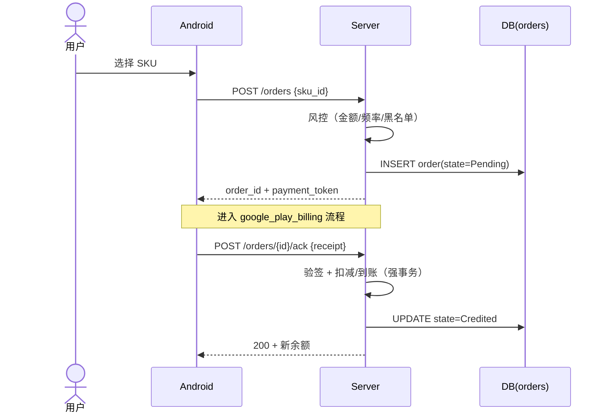

# Spec: 充值订单 (recharge_order)

> **状态**：活跃（覆盖 E-08 充值/订单系统通用部分）
> **覆盖 Task 簇**：订单 Schema、创建订单 API、风控、订单查询/补单/退款、SKU CRUD、Web 订单列表/详情、Android 充值页与历史页、Dev/Staging Mock 通道
> **最后更新**：2026-05-15

---

## §1 关联 Task 簇

[`doc/tasks/模块10-E-08 充值订单与 Google Play 计费.md`](../tasks/模块10-E-08%20充值订单与%20Google%20Play%20计费.md)（共享）

| 端 | TaskID | 一句话职责 |
|---|---|---|
| server | T-00050 | 订单与 SKU Schema |
| server | T-00051 | 创建订单 API + 风控 |
| server | T-00054 | 待 ACK 订单后台对账 cron |
| server | T-00055 | Dev/Staging Mock 充值通道 |
| adminServer | T-10025 | 订单查询 API |
| adminServer | T-10026 | 手动补单 / 退款 API |
| adminServer | T-10027 | SKU CRUD API |
| adminServer | T-10028 | 财务汇总 API |
| android | T-30060 | 充值页 UI（SKU 列表）|
| android | T-30064 | 充值历史页 |
| android | T-30065 | Dev/Staging 测试购买入口 |
| web | T-20030 | 订单列表与详情页 |
| web | T-20031 | 补单/退款弹窗 |
| web | T-20032 | SKU 管理页 |
| web | T-20033 | 财务报表页 |

---

## §2 事实源锚点

- 协议：[`protocol/billing_api.md`](../protocol/billing_api.md)（如不存在，并入 `gift_api.md` 订单章节）、[`protocol/admin_api.md`](../protocol/admin_api.md)
- 状态机：[`state_machines.md#order`](../product/state_machines.md#order)
- 旅程：[`user_journeys.md#j1-recharge-gift-noble`](../product/user_journeys.md#j1-recharge-gift-noble)
- 业务约束：
  - 单笔订单上限 `ORDER_AMOUNT_MAX_USD`
  - 同一用户日订单数上限 `ORDER_DAILY_COUNT_LIMIT`
  - 创建订单后 `ORDER_PENDING_TTL_SEC` 未支付 → Cancelled
  - 退款最大负余额 `REFUND_NEGATIVE_BALANCE_LIMIT_GOLD`

---

## §3 流程图（裁剪后）

### 异常分支必覆清单
- [x] 风控拒绝 → 不创建订单 + 审计 `order_blocked`
- [x] Pending 超 `ORDER_PENDING_TTL_SEC` → cron 标记 Cancelled
- [x] 同一 receipt 重复 ack → 幂等（基于 `provider_order_id` 唯一索引）
- [x] 退款使余额变负 → 仅允许至 `REFUND_NEGATIVE_BALANCE_LIMIT_GOLD`，超出标记 `manual_review`
- [x] Mock 通道在 prod 编译被剔除（feature flag）

---

## §4 边界不变量

- **INV-O1**：订单状态转换**唯一**以 `state_machines.md#order` 为准；非法跃迁返回 409。
- **INV-O2**：到账（state=Credited）必须与钱包变更在**同一 SQLx 事务**，禁止分两步。
- **INV-O3**：`provider_order_id` UNIQUE 索引为幂等唯一手段，**禁止**用 `msg_id` 替代。
- **INV-O4**：退款不删除原订单记录，新增 reverse 事务并回写 state=Refunded。
- **INV-O5**：管理员补单/手动退款必须经 RBAC 校验 + audit_logs（与 admin_dashboard INV-D2 一致）。

---

## §5 验收条款（GWT）

### GWT-O1（创建订单风控）
- **Given** 用户当日已创建 `ORDER_DAILY_COUNT_LIMIT` 个订单
- **When** 再次创建
- **Then** 返回 429 `order_rate_limit`；不写表

### GWT-O2（Pending 超时取消）
- **Given** 订单 state=Pending 已存在 `ORDER_PENDING_TTL_SEC + 1` 秒
- **When** cron 扫描
- **Then** state → Cancelled；广播 `OrderCancelled`（如客户端在线）

### GWT-O3（到账原子性）
- **Given** ack 接口被并发调用 2 次
- **When** 同一 `provider_order_id`
- **Then** 仅一次写 wallet_changes + orders 表；第二次返回 200 + 相同结果（幂等）

### GWT-O4（退款负余额限制）
- **Given** 用户当前余额 100 金币，订单为 200 金币
- **When** 全额退款
- **Then** 余额 = -100；超 `REFUND_NEGATIVE_BALANCE_LIMIT_GOLD` 时拒绝退款，标记 `manual_review` 入审计

### GWT-O5（Mock 通道隔离）
- **Given** prod 构建
- **When** grep 编译产物中 `MockBilling`
- **Then** 零结果

---

## §6 变更记录

| 版本 | 日期 | 摘要 |
|------|------|------|
| v1.0 | 2026-05-15 | 初版 |
