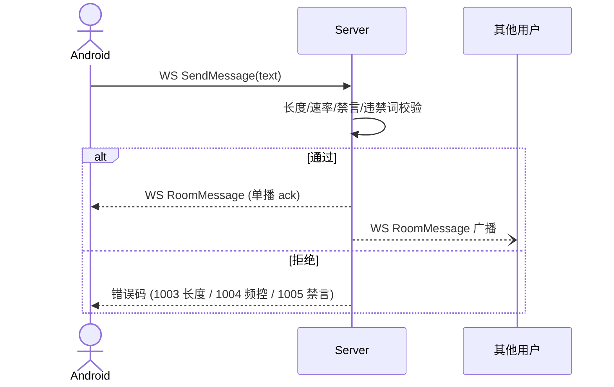

# Spec: 房间公屏聊天 (room_chat)

> **状态**：已归档
> **覆盖 Epic**：E-03 房间内核心 - 公屏
> **最后更新**：2026-05-15

---

## §1 关联 Task 簇

[`doc/tasks/模块3-房间内核心功能 (In-Room Core).md`](../tasks/模块3-房间内核心功能%20(In-Room%20Core).md) 中公屏聊天：SendMessage / RoomMessage 广播 / 历史拉取 / 速率限制 / 禁言。

---

## §2 事实源锚点

- 协议：[`protocol/websocket_signals.md`](../protocol/websocket_signals.md)（SendMessage / RoomMessage）；HTTP 备用 `protocol/room_api.md`
- 状态机：N/A（无独立状态机；隶属于 UserSession.InRoom）
- 旅程：[`user_journeys.md#j2-host-room-lifecycle`](../product/user_journeys.md#j2-host-room-lifecycle)
- 业务约束：`CHAT_MSG_MAX_CHARS` / `CHAT_MSG_RATE_PER_SEC` / `CHAT_MSG_RATE_BURST` / `CHAT_HISTORY_KEEP_COUNT` / `MUTE_DURATION_L1_MIN` / `MUTE_DURATION_L2_MIN`

---

## §3 流程图（裁剪后）

### 异常分支必覆清单
- [x] 超长消息（> `CHAT_MSG_MAX_CHARS`）→ 拒绝
- [x] 超频（> `CHAT_MSG_RATE_PER_SEC` 持续）→ 拒绝
- [x] 用户被禁言 / 在 Muted 麦位 → 拒绝
- [x] 房间不存在 / 用户不在房 → 拒绝
- [x] 违禁词命中 → 拒绝 + 记审计流

---

## §4 边界不变量

- **INV-C1**：客户端发送到广播必须**唯一经过** WS `SendMessage` 路径（⭐ 路径）；REST 路径仅留作 admin 工具，禁止业务客户端使用。
- **INV-C2**：消息长度 server 端必须以 Unicode codepoint 计 ≤ `CHAT_MSG_MAX_CHARS`，禁止以字节数。
- **INV-C3**：每条 RoomMessage 必须携带稳定 `msg_id`（UUID v4），客户端按 `msg_id` 去重。
- **INV-C4**：进房拉取历史**至多** `CHAT_HISTORY_KEEP_COUNT` 条。

---

## §5 验收条款（GWT）

### GWT-C1（长度上限）
- **Given** 用户输入 `CHAT_MSG_MAX_CHARS + 1` 字符消息
- **When** 调 SendMessage
- **Then** 返回错码 1003；DB 无写入；不广播

### GWT-C2（速率限制）
- **Given** 用户已在 1 秒内发送 `CHAT_MSG_RATE_BURST` 条消息
- **When** 第 `BURST+1` 条紧接到达
- **Then** 返回错码 1004；客户端 UI 提示冷却

### GWT-C3（去重）
- **Given** 客户端因网络抖动以同一 `msg_id` 重发
- **When** Server 收到
- **Then** 仅广播 1 次；DB 记录幂等

### GWT-C4（禁言）
- **Given** 用户被 L1 禁言 `MUTE_DURATION_L1_MIN` 分钟
- **When** 期间调 SendMessage
- **Then** 返回错码 1005 + 剩余秒数

---

## §6 变更记录

| 版本 | 日期 | 摘要 |
|------|------|------|
| v1.0 | 2026-05-15 | 初版归档 |
