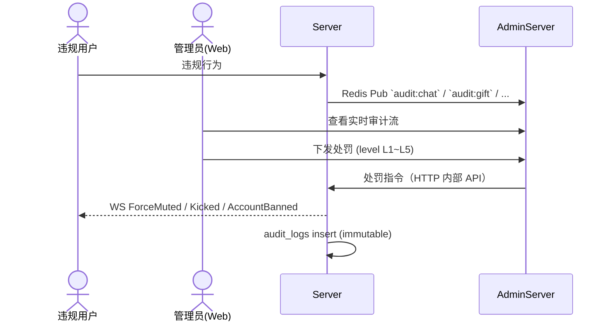

# Spec: 房间治理与风控 (room_governance)

> **状态**：已归档
> **覆盖 Epic**：E-10 房间主权与管理员体系
> **最后更新**：2026-05-15

---

## §1 关联 Task 簇

[`doc/tasks/模块8-房间主权与管理员体系 (E-10).md`](../tasks/模块8-房间主权与管理员体系%20(E-10).md)。

---

## §2 事实源锚点

- 协议：[`protocol/admin_api.md`](../protocol/admin_api.md)、[`protocol/websocket_signals.md`](../protocol/websocket_signals.md)（ForceMuted / Kicked / AccountBanned / GovernanceNotice）、[`protocol/pubsub_channels.md`](../protocol/pubsub_channels.md)（`audit:*`）
- 状态机：[`state_machines.md#user-session`](../product/state_machines.md#user-session)、[`state_machines.md#mic-seat`](../product/state_machines.md#mic-seat)
- 旅程：[`user_journeys.md#j3-governance`](../product/user_journeys.md#j3-governance)
- 业务约束：`MUTE_DURATION_L1_MIN` / `MUTE_DURATION_L2_MIN` / `BAN_DURATION_L4_DAYS` / `BAN_DURATION_L5_DAYS` / `KICK_COUNT_24H_AUTOBAN_THRESHOLD` / `REPORT_COOLDOWN_SEC` / `MIC_KICK_BAN_HOURS`

---

## §3 流程图（裁剪后）

### 异常分支必覆清单
- [x] 同一举报源 `REPORT_COOLDOWN_SEC` 内重复举报 → 拒绝
- [x] 用户在被踢 24h 内重新进入同房 → 拒绝（`MIC_KICK_BAN_HOURS`）
- [x] 24h 内被踢 ≥ `KICK_COUNT_24H_AUTOBAN_THRESHOLD` → 自动封号 24h
- [x] 二审撤销 → 状态回写 + audit_logs 追加 reverse 记录（**不删原记录**）
- [x] AdminServer 写主库 → P0 违规（红线 3 防腐层）

---

## §4 边界不变量

- **INV-V1**：AdminServer **只**通过 Redis Pub/Sub 接收审计事件、**只**通过内部 HTTP API 下发指令，**禁止**直连业务主库写操作。
- **INV-V2**：`audit_logs` 一旦写入**不可篡改**，撤销以追加 reverse 记录方式实现。
- **INV-V3**：处罚 level 与时长映射唯一以 `business_constraints.md#governance` 为准。
- **INV-V4**：所有处罚必须有操作人 ID + 原因 + 关联证据 ID（消息/礼物/举报 ID）。

---

## §5 验收条款（GWT）

### GWT-V1（防腐层隔离）
- **Given** 代码审查
- **When** grep AdminServer 代码中是否含 `INSERT|UPDATE|DELETE` on 业务主库表
- **Then** 零结果

### GWT-V2（自动封号阈值）
- **Given** 用户在 24h 内已被 ownerKick `KICK_COUNT_24H_AUTOBAN_THRESHOLD - 1` 次
- **When** 再次被 ownerKick
- **Then** 自动封号 24h；UserSession 强制 → Anonymous；WS 断开

### GWT-V3（举报冷却）
- **Given** 用户 A 已在 30 秒前举报用户 B
- **When** A 再次举报 B
- **Then** 返回 429（来自 `REPORT_COOLDOWN_SEC`）

### GWT-V4（审计不可篡改）
- **Given** audit_logs 已有处罚记录 R1
- **When** 管理员二审撤销
- **Then** 新增 R2(reverse, ref=R1)；R1 保持不变；DB 表无 UPDATE/DELETE 语句

---

## §6 变更记录

| 版本 | 日期 | 摘要 |
|------|------|------|
| v1.0 | 2026-05-15 | 初版归档 |
