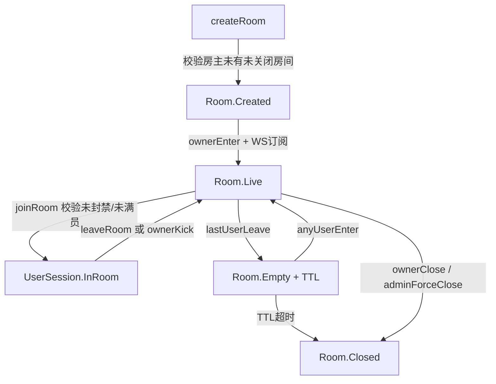

# Spec: 房间生命周期与大厅 (room_lifecycle)

> **状态**：已归档
> **覆盖 Epic**：E-02 房间大厅与列表 / E-03 房间内核心
> **最后更新**：2026-05-15

---

## §1 关联 Task 簇

[`doc/tasks/模块2-房间大厅与列表 (Room Hall).md`](../tasks/模块2-房间大厅与列表%20(Room%20Hall).md) + 模块3 中的 createRoom / closeRoom / joinRoom / leaveRoom 部分。

---

## §2 事实源锚点

- 协议：[`protocol/room_api.md`](../protocol/room_api.md)、[`protocol/websocket_signals.md`](../protocol/websocket_signals.md)（RoomLive / RoomClosed / UserJoined / UserLeft）
- 状态机：[`state_machines.md#room`](../product/state_machines.md#room)、[`state_machines.md#user-session`](../product/state_machines.md#user-session)
- 旅程：[`user_journeys.md#j2-host-room-lifecycle`](../product/user_journeys.md#j2-host-room-lifecycle)
- 业务约束：`ROOM_EMPTY_TTL_SEC` / `ROOM_MAX_USERS` / `ROOM_TITLE_MAX_CHARS` / `ROOM_NOTICE_MAX_CHARS` / `ROOM_TITLE_REGEX` / `WS_HEARTBEAT_TIMEOUT_SEC`

---

## §3 流程图（裁剪后）

### 异常分支必覆清单
- [x] 房主已有未关闭房间 → 拒绝创建
- [x] 房间已满（≥ `ROOM_MAX_USERS`）→ 入房失败
- [x] 用户在该房间被踢 24h 内重入 → 拒绝
- [x] 房主心跳超时 `WS_HEARTBEAT_TIMEOUT_SEC` → 宽限后 Room.Closed
- [x] 标题违反 `ROOM_TITLE_REGEX` → 400 + 文案提示

---

## §4 边界不变量

- **INV-R1**：同一用户**最多持有 1 个未 Closed 的房间**。
- **INV-R2**：Room.Closed 必须级联将所有 MicSeat → Idle 并将所有 InRoom 用户 → Authed。
- **INV-R3**：Room.Empty 在 `ROOM_EMPTY_TTL_SEC` 内任意用户进入必须回到 Room.Live，期间不得 Closed。
- **INV-R4**：房间标题/公告 server 端必须按 `ROOM_TITLE_MAX_CHARS` / `ROOM_NOTICE_MAX_CHARS` 截断或拒绝。

---

## §5 验收条款（GWT）

### GWT-R1（创建房间互斥）
- **Given** 用户 U 已有 Room.Live
- **When** 再次调用 createRoom
- **Then** 返回 409 + 原房间 ID

### GWT-R2（空房 TTL）
- **Given** Room.Empty，距 lastUserLeave 已过 `ROOM_EMPTY_TTL_SEC`
- **When** Cron / TTL 触发
- **Then** Room → Closed；广播 `RoomClosed`；DB `rooms.closed_at` 写入

### GWT-R3（强制关闭级联）
- **Given** Room.Live 含 3 名 MicSeat 占位 + 50 名观众
- **When** 管理员 adminForceClose
- **Then** 所有 MicSeat → Idle；所有 UserSession.InRoom → Authed；广播 `RoomClosed`

### GWT-R4（满员拒入）
- **Given** Room 在线人数已达 `ROOM_MAX_USERS`
- **When** 新用户 joinRoom
- **Then** 返回 423 + i18n 文案；客户端不进入 RoomActivity

---

## §6 变更记录

| 版本 | 日期 | 摘要 |
|------|------|------|
| v1.0 | 2026-05-15 | 初版归档 |
