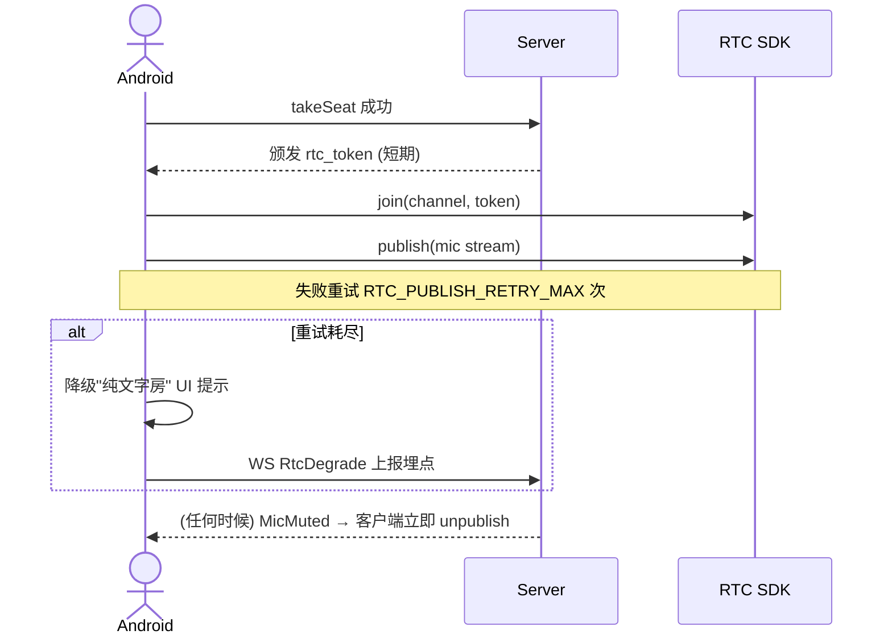

# Spec: 实时语音 (rtc_voice)

> **状态**：已归档
> **覆盖 Epic**：E-03 房间内核心 - RTC
> **最后更新**：2026-05-15

---

## §1 关联 Task 簇

[`doc/tasks/模块3-房间内核心功能 (In-Room Core).md`](../tasks/模块3-房间内核心功能%20(In-Room%20Core).md) 中 RTC 接入与防腐层：rtcJoin / rtcPublish / rtcSubscribe / rtcLeave / 推流权限同步。

---

## §2 事实源锚点

- 协议：[`protocol/room_api.md`](../protocol/room_api.md)（rtc token 颁发）、[`protocol/websocket_signals.md`](../protocol/websocket_signals.md)（MicMuted 触发取消推流权限）
- 状态机：[`state_machines.md#mic-seat`](../product/state_machines.md#mic-seat)（推流权限挂钩 MicSeat 状态）
- 业务约束：`RTC_PUBLISH_RETRY_MAX` / `WS_HEARTBEAT_TIMEOUT_SEC`

---

## §3 流程图（裁剪后）

### 异常分支必覆清单
- [x] RTC join 失败 / token 过期
- [x] publish 失败 → 重试 `RTC_PUBLISH_RETRY_MAX` 次 → 降级
- [x] MicMuted 时客户端必须立即 unpublish
- [x] MicSeat → Idle 时必须 leave RTC 频道
- [x] WS 断开 `WS_HEARTBEAT_TIMEOUT_SEC` → 客户端主动 leave RTC

---

## §4 边界不变量

- **INV-T1**：RTC 推流权限**完全由** Server 通过 MicSeat 状态控制；客户端禁止本地决定是否推流（红线 1）。
- **INV-T2**：所有 RTC SDK 调用必须通过防腐层 `RtcAdapter`，业务层禁止直接 import 厂商 SDK（红线 3）。
- **INV-T3**：rtc_token 必须短期（≤ 1h），过期后必须重新向 Server 申请。
- **INV-T4**：RTC 不可用时房间业务（聊天 / 礼物 / 麦位状态）必须仍可用。

---

## §5 验收条款（GWT）

### GWT-T1（禁麦立即停推）
- **Given** 用户在麦位 Occupied 状态推流中
- **When** 房主触发 ownerMute
- **Then** 客户端在 ≤ 500ms 内 unpublish；UI 显示禁麦图标

### GWT-T2（重试降级）
- **Given** RTC publish 连续失败 `RTC_PUBLISH_RETRY_MAX` 次
- **When** 重试耗尽
- **Then** 客户端不再重试；显示降级 toast；上报埋点 `rtc_degrade`

### GWT-T3（防腐层隔离）
- **Given** 代码审查
- **When** 在 `app/android/.../domain/` 或 `app/android/.../ui/` 下 grep `import io.agora`/`import com.zego`
- **Then** **零结果**（仅 `infrastructure/rtc/` 允许）

---

## §6 变更记录

| 版本 | 日期 | 摘要 |
|------|------|------|
| v1.0 | 2026-05-15 | 初版归档 |
